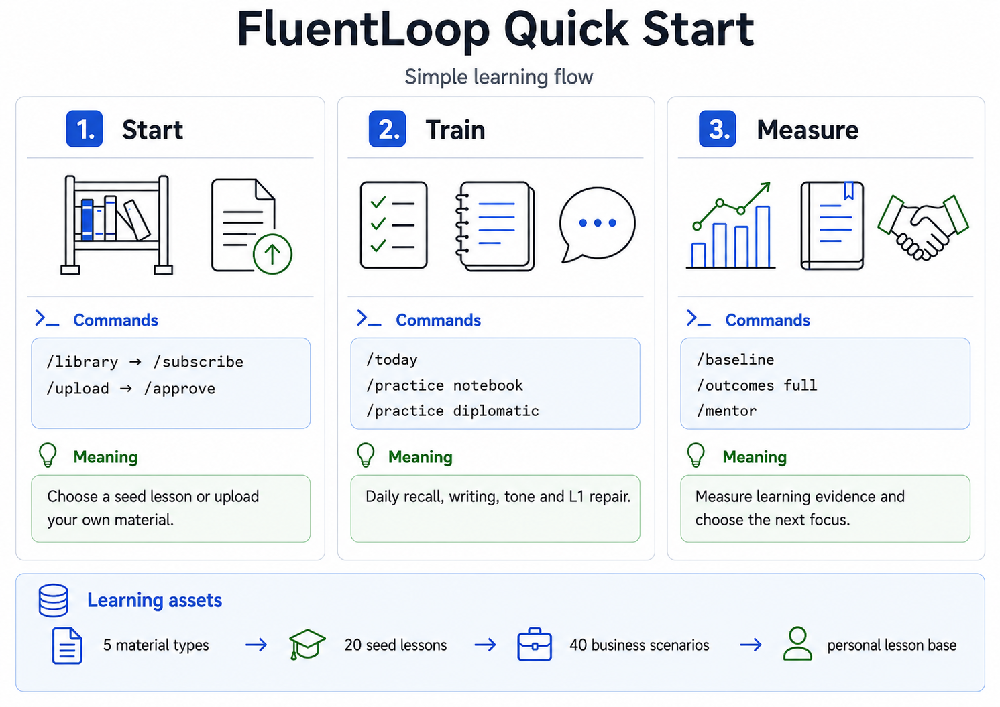

# FluentLoop

> Telegram bot for English learning. B2+/C1- focus, business and IT context,
> text-only MVP, shared seed lesson library, measurable outcomes loop, single Docker container on a VPS.

[](https://github.com/eiler2005/FluentLoop/actions/workflows/ci.yml)
[](https://www.python.org/downloads/)
[](LICENSE)
[](docker-compose.yml)
[](https://docs.telethon.dev/)
[](docs/features/README.md)

## TL;DR

FluentLoop is an English-learning bot that lives entirely in Telegram. You can
drop in your own lesson notes or subscribe to an owner-curated B2/B2+ seed
lesson, then the bot turns approved targets into spaced repetition and a daily
~15-minute, 15-20-drill practice session in a Telegram forum workspace.
Mistakes feed a pattern detector; recurring patterns shape future practice.
`/baseline` and `/outcomes` show whether the learning loop is producing
measurable progress.
The runtime is intentionally small: Telethon, SQLite, APScheduler, a
DeepSeek-backed LLM gateway with deterministic fallback, all in one
`python:3.11-slim` container.

The original MVP (14 epics) plus a learning-engine roadmap (6 more epics) were
shipped in a single autonomous overnight build session; EPIC-22..24 now add the
breakthrough pedagogy, shared lesson library, and outcome-measurement layer.
See [`docs/build-log/`](docs/build-log/) for the frozen build record.



## Start here if you want to learn

If you are here as a learner, not as a developer, read these first:

| What you need | Where to look |
|---|---|
| Understand what FluentLoop does | [`docs/user-guide.md`](docs/user-guide.md) |
| Understand the learning methodology | [`docs/learning-methodology.md`](docs/learning-methodology.md) |
| Start this week without thinking too much | [`docs/learning-plans.md`](docs/learning-plans.md) |
| Prepare your own lesson notes for `/upload` | [`docs/material-upload-guide.md`](docs/material-upload-guide.md) |
| See lesson types and public catalogs | [`docs/lesson-catalog/index.md`](docs/lesson-catalog/index.md) |

The simplest path inside Telegram:

```text
/setup
/library
/subscribe <template_id>
/baseline <your 120-180 word answer>
/today
/outcomes full
```

`/setup` runs a short wizard — topics, vocabulary kinds, list size, words per
day — and seeds a starter list from the word bank shipped with the repo. After
that the bot reaches out three times a day on its own:

```text
🌅 Morning   your words with example sentences
✍️ Midday    a quick drill; some days you write your own sentence
🌙 Evening   a short quiz
```

Right answers push a word further out; it graduates once you have mastered it.
Send any word or phrase as a plain message to add it — commas or new lines for
several at once. Your own words always get top priority. `/pause` and `/resume`
turn the daily messages off and back on.

The cards and the lessons train the same words; the commands differ in how hard
they make you work:

| Command | Time | What it does |
|---|---|---|
| `/cards` | 0 min | shows cards — you only read them |
| `/review` | 2-3 min | five recall drills plus a cold-recall closer |
| `/practice vocab` | 15 min | the full vocabulary lesson |
| `/today` | — | asks which of the two tracks you want |

`/start` installs a keyboard under the input field — Cards, Review, Lesson,
My words, Add words — so practice is one tap from anywhere in the chat.

If you already have material from a teacher, work, Slack, email, an article, or
meeting notes, start with:

```text
/upload
/approve <material_id>
/today
```

## Learning methodology in plain English

FluentLoop is built around a loop, not around random exercises:

```text
input -> lesson type -> practice mode -> exercise type -> feedback ->
SRS/mistakes -> outcomes -> next focus
```

What that means in practice:

- **Approved input.** You upload material or subscribe to a seed lesson. New
  learning targets become active only after approval, so the bot does not train
  noise.
- **Lesson type.** Every lesson is shown as vocabulary, chunks, grammar,
  mistakes, diplomatic, notebook, reading, writing, genre, scenario, review,
  mixed, or outcomes. This tells you what the lesson trains and where to go
  next.
- **Daily recall.** `/today` asks you to produce English from memory. This is
  stronger than rereading phrase lists.
- **Layered feedback.** Feedback is split into `Errors`, `Native`, and `Why`:
  fix mistakes, sound more natural, and understand the pattern.
- **Sub-day SRS.** Weak items can come back quickly, even inside the same day,
  until you can use them actively.
- **Mistake and L1 loop.** Repeated errors and Russian-transfer traps become
  explicit practice targets.
- **Reflection.** `/reflect` and `/mentor` turn hard moments into a private
  Coach Journal.
- **Outcome measurement.** `/baseline` records a monthly starting point;
  `/outcomes` shows learning evidence: retention, chunk use, L1 density,
  writing metrics, mistake extinction, and reading probes.

For the full methodology map, see
[`docs/learning-methodology.md`](docs/learning-methodology.md).

## Current lessons and practice surfaces

FluentLoop has three different sources of practice. They are intentionally
separate:

1. **Your own materials** via `/upload`: teacher notes, phrase lists, Slack or
   email drafts, articles, and meeting notes. See
   [`docs/material-upload-guide.md`](docs/material-upload-guide.md).
2. **Shared seed lessons** via `/library` and `/subscribe`. The generated public
   catalog lives in [`docs/lesson-catalog/index.md`](docs/lesson-catalog/index.md):
   B2/B2+ seed lessons, the English for Tech series, lesson types, and scenario
   cards.
3. **40 business/IT scenario cards** via `/scene <topic or number>` for quick
   roleplay and pre-meeting rehearsal. Examples: design review, code review
   feedback, incident postmortem, scope negotiation, customer escalation,
   performance review, deadline refusal, and admitting "I do not know" without
   losing face.

After you subscribe or approve material, your personal lesson base is visible
through `/topics`, `/lessons`, `/lesson <id>`, and is used by `/today`.
`/lesson <id>` shows the lesson type, what it trains, and the target mix
before you start.

## Architecture at a glance

```
              ┌─────────────────────────────────────────────────────┐
              │ Telegram (forum + DM, admitted users)               │
              │ /today /baseline /outcomes /upload /library /skip ... │
              └─────────────────────────┬───────────────────────────┘
                                        │ MTProto long-poll + Bot API
                                        ▼
   ┌────────────────────────────────────────────────────────────────────────┐
   │ src/fluentloop/                                                        │
   │                                                                        │
   │  bot/             ┌─── learning_engine ─── lesson_plans ─── practice ──┤
   │   ├ app.py        │           │                  │              │      │
   │   ├ handlers/  ───┤           ▼                  ▼              ▼      │
   │   ├ state.py      │       materials ─────── exercises ─── mistakes     │
   │   └ workspace/    │           │                  │              │      │
   │                   │           └──────────┬───────┴──────────────┘      │
   │                   │                      ▼                             │
   │                   │       db/  (SQLAlchemy 2.x, Alembic, SQLite)       │
   │                   │                      │                             │
   │                   ▼                      ▼                             │
   │              ai/ provider     llm/ DeepSeek gateway                    │
   │              (OpenAI tiered)  (task-aware, JSON, fallback)             │
   └────────────────────────────────────────────────────────────────────────┘
                                        │
                                        ▼
                   APScheduler (in-process, three jobs)
                   ├─ Daily reminder (User.reminder_time)
                   ├─ Overnight pre-gen (PRE_GEN_HOUR=3)
                   └─ Daily SQLite backup (BACKUP_HOUR=4, 14d retention)
```

Full architecture document: [`docs/architecture.md`](docs/architecture.md).
Decisions behind the choices: [`docs/adr/`](docs/adr/) (0002-0008 Accepted).
Learner-facing methodology and daily workflow: [`docs/user-guide.md`](docs/user-guide.md).
Methodology map: [`docs/learning-methodology.md`](docs/learning-methodology.md).
Generated public lesson catalog: [`docs/lesson-catalog/index.md`](docs/lesson-catalog/index.md).
Practical first-week, 30-day, and 12-week plans:
[`docs/learning-plans.md`](docs/learning-plans.md).
Upload-ready material examples: [`docs/material-upload-guide.md`](docs/material-upload-guide.md).

## Sample session

A real `/today` session, sanitized:

```
You          /today
Bot          Practice — Step 1/15  •  Stakeholder pushback
             Cloze: "We need to ____ the timeline because the API
             schema isn't stable yet."
                     [ revisit ]   [ shift ]   [ extend ]

You          extend
Bot          ✅ Correct.
             Stronger: in this register native speakers also say
             "push back the timeline" or "buy ourselves another
             week." Both keep the polite-but-firm tone.

             Step 2/15  •  Risk mitigation
             Rewrite to a more neutral register:
               "We are absolutely positively going to miss the deadline."
             →

You          We're likely to miss the deadline.
Bot          ✅ Correct.
             Note: you dropped the "absolutely positively" intensifier,
             which is the right move for stakeholder updates. Saved as
             a positive example under pattern: register/intensifiers.

...

Bot          Session done — 15/15 in 14 min.
             SRS: 9 items advanced, 3 hard, 3 new.
             Mistake patterns: 1 promoted to confidence=high.
             /stats for the weekly view.
```

(Real sessions live in the gitignored `data/` directory.)

## Tech stack

- **Bot layer** — Telethon 1.36 in bot mode, Bot API for forum-topic sends
  and the command menu, custom in-memory FSM persisted to SQLite
  (`bot/state.py`).
- **Persistence** — SQLAlchemy 2.x ORM + Alembic migrations, SQLite single
  file mounted from the host into `/app/data`.
- **Scheduling** — APScheduler 3.10 in-process, five cron-style jobs:
  daily reminder, 03:00 overnight pre-gen, 04:00 SQLite backup, weekly
  summary, and a minute tick that delivers the daily vocabulary loop at each
  learner's own local slot times.
- **AI** — provider abstraction in `src/fluentloop/ai/`; an
  OpenAI-compatible gateway in `src/fluentloop/llm/` with task-aware
  Pro/Flash routing, JSON contract, bounded timeout/retry/fallback policy.
  `AI_PROVIDER` selects `stub`, `openai`, `deepseek`, or `qwen`.
- **Ops** — Dockerfile + `docker-compose.yml`, `scripts/deploy.sh` for
  rsync+SSH+`docker compose` to the VPS, GitHub Actions CI on every push.

## What's built

| Slice | Status |
|---|---|
| **MVP foundation** — EPIC-01..14 (bot, profile, upload, AI extract+approve, items CRUD, SRS, daily session, exercise types, answer feedback, mistake patterns, grammar graph, stats, favorites) | ✅ Done |
| **Learning-engine roadmap** — EPIC-16..21 (staged engine, persistent lesson plans, DeepSeek gateway, AI exercise generator, grammar brain, light material context search) | ✅ Done |
| **Breakthrough roadmap** — EPIC-22 (layered feedback, sub-day SRS, lesson formats, curriculum, teacher layer, operational drills, polish) | ✅ Done |
| **Shared lesson library** — EPIC-23 (`/library`, `/subscribe`, seed catalog templates, per-user clones) | ✅ Done |
| **Learning outcomes loop** — EPIC-24 (`/baseline`, `/outcomes`, held-out retention, productive chunks, writing/L1 metrics, mistake extinction, Article probes) | ✅ Done |
| **EPIC-15** Web UI | ⏸ Deferred (re-evaluate after 4–6 weeks) |

Full per-epic table with dependency graph:
[`docs/features/README.md`](docs/features/README.md).

## Quick start

```bash
# 1. clone and install
git clone https://github.com/eiler2005/FluentLoop.git
cd FluentLoop
uv sync --extra dev          # or: pip install -e ".[dev]"

# 2. config
cp .env.example .env
# edit .env: TELEGRAM_BOT_TOKEN, TELEGRAM_API_ID, TELEGRAM_API_HASH,
#           TELEGRAM_ALLOWED_USER_ID, AI_PROVIDER, AI keys, DB_URL, TIMEZONE
python scripts/check_env.py  # validates non-empty + non-placeholder

# 3. run locally (foreground, for testing)
uv run python -m fluentloop

# or 3'. run via Docker
docker compose up -d --build
docker compose logs -f fluentloop
```

After the bot is up, send `/start` from your Telegram account (the one in
`TELEGRAM_ALLOWED_USER_ID`). For the production deploy path see
[`docs/runbooks/deploy.md`](docs/runbooks/deploy.md).

## Project layout

```
FluentLoop/
├── PRD.md                  Product requirements (the *what*).
├── README.md               You are here.
├── AGENTS.md               Durable rules for AI agents and humans.
├── CLAUDE.md               Thin Claude Code entrypoint.
├── SECURITY.md             Threat model, secrets policy, privacy disclosure.
├── CHANGELOG.md            Versioned release notes.
├── CONTRIBUTING.md         Dev setup, PR workflow.
├── LICENSE                 MIT.
├── docs/
│   ├── architecture.md     Tech architecture (the *how*).
│   ├── testing.md          Standard test gate.
│   ├── adr/                8 architecture decision records.
│   ├── features/           Epic files and roadmap index.
│   ├── runbooks/           deploy, demo data, secrets, telegram workspace.
│   ├── curriculum/         Generated B2/B2+ lesson catalog.
│   └── build-log/          Autonomous-build journal (frozen).
├── src/fluentloop/         Python package.
├── tests/                  Pytest suite.
├── scripts/                Deploy, smoke, seed, secret-scan helpers.
├── migrations/             Alembic migrations.
├── ansible/                Deploy playbooks (placeholder).
├── Dockerfile
├── docker-compose.yml
└── .github/workflows/ci.yml
```

## Documentation map

| File | Purpose |
|---|---|
| [`PRD.md`](PRD.md) | Product requirements — verbatim, the source of product truth. |
| [`docs/architecture.md`](docs/architecture.md) | Tech architecture, runtime topology, data model. |
| [`docs/adr/`](docs/adr/) | One ADR per significant decision (Telethon, AI tiering, pre-gen, forum routing, secret hygiene, DeepSeek, shared library). |
| [`docs/features/README.md`](docs/features/README.md) | Epic index with dependency graph and statuses. |
| [`docs/user-guide.md`](docs/user-guide.md) | Learner-facing methodology, process map, daily workflow, and modes. |
| [`docs/learning-plans.md`](docs/learning-plans.md) | Practical first-week, 30-day, and 12-week learning plans. |
| [`docs/material-upload-guide.md`](docs/material-upload-guide.md) | Upload-ready material formats and LLM prep prompt. |
| [`docs/runbooks/`](docs/runbooks/) | Operational procedures — deploy, demo data, secrets, telegram workspace, curriculum seed. |
| [`docs/testing.md`](docs/testing.md) | Standard pre-commit / pre-deploy gate. |
| [`tests/README.md`](tests/README.md) | What each test module covers, patterns used, CI gate. |
| [`docs/build-log/`](docs/build-log/) | The autonomous overnight build session — brief, morning report, deferred questions. |
| [`SECURITY.md`](SECURITY.md) | Secrets policy, threat model, third-party data flow. |
| [`AGENTS.md`](AGENTS.md) | Durable workflow rules for any AI agent (or human) editing the repo. |

## Tests

```bash
uv run --extra dev pytest -q
# 20 modules, 121+ tests, < 30 s locally.
```

The CI gate (`.github/workflows/ci.yml`) runs `secret_scan` →
`ruff check src tests scripts` → `pytest -q` on every push and PR.
Full breakdown: [`tests/README.md`](tests/README.md).

## Roadmap and non-goals

**Likely next** — flagged as P1 in the PRD or in epic "Open questions":

- Off-VPS backup target (B2 / restic / rsync) for `data/backups/`.
- A redact-list mechanism for material text sent to the AI provider.
- Optional `/health` endpoint for VPS-side monitoring.

**Explicitly not goals** — please don't open PRs for these without prior
discussion:

- Full multi-tenant SaaS auth. Admission policy beyond the current environment
  gate is tracked separately from the shared lesson library.
- Voice support.
- A public web UI (EPIC-15 is `Deferred`).
- Unreviewed generic content import beyond the user's own lesson notes and the
  deterministic shared seed catalog.

## Secrets and privacy

- Real bot tokens, API keys, and personal user IDs never appear in the
  repository or in commit messages. CI runs `scripts/secret_scan.py` to
  catch obvious leaks.
- Local confidential data lives in the gitignored `secrets/` catalog
  (e.g. `secrets/fluentloop.env` is the ready-to-copy source for `.env`).
- Lesson notes, answers, and mistakes are private learning data. They
  may be sent to the configured AI provider (OpenAI / DeepSeek / Anthropic
  depending on `AI_PROVIDER`). Read [`SECURITY.md`](SECURITY.md) before
  changing provider or logging behavior.

## License

[MIT](LICENSE) — © 2026 Denis Ermilov.
