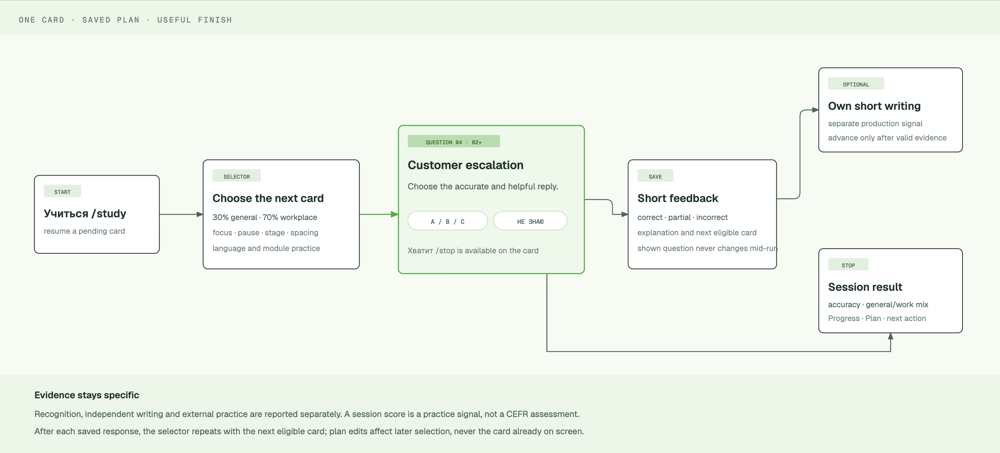
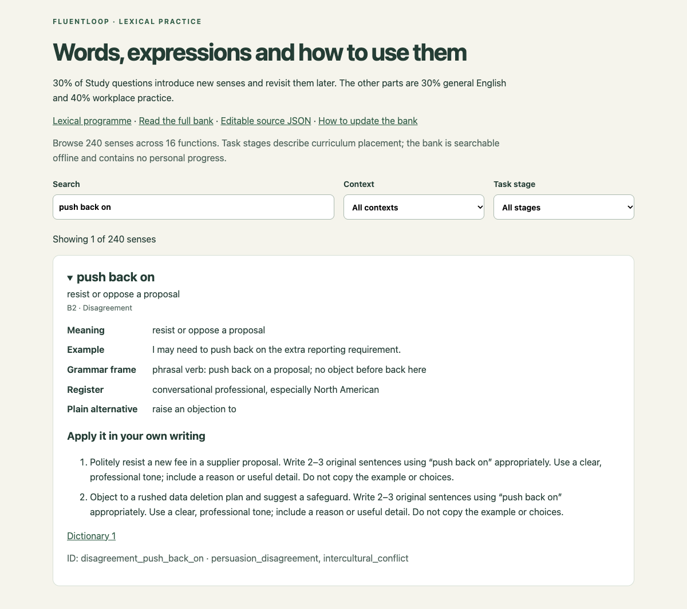
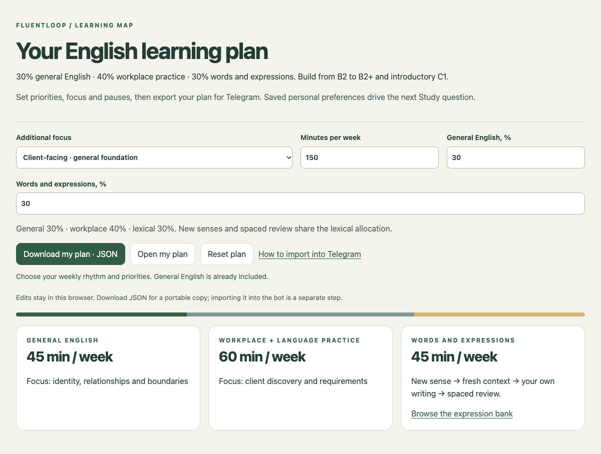
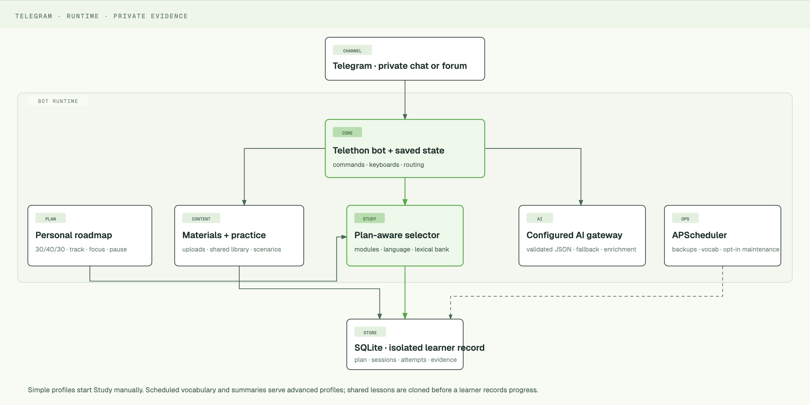

# FluentLoop


**English for life & work.** A Telegram learning companion for B2 → B2+ →
introductory C1, with general English as the foundation and client, business
and technology situations as supplements.

[](https://github.com/eiler2005/FluentLoop/actions/workflows/ci.yml)
[](https://www.python.org/downloads/)
[](LICENSE)
[](docker-compose.yml)
[](https://docs.telethon.dev/)
[](docs/features/README.md)

[Программа и схемы обучения](docs/curriculum/learning-programme.md) ·
[Start learning](#start-here-if-you-want-to-learn) ·
[Personal plan](docs/curriculum/workplace-plan-guide.md) ·
[Words and expressions](docs/curriculum/lexical-programme.md) ·
[Visual planner](docs/curriculum/workplace-planner.html) ·
[Research](docs/research/README.md) ·
[Self-hosting](#quick-start) ·
[Documentation](#documentation-map)

## TL;DR

Press **Учиться**: answer one question, read a short explanation and continue
until **Хватит**. Optional short writing lets you apply what you learned.
Simple mode runs on request and resumes an unfinished question after a restart.

A saved personal plan connects this stream to **48 modules: 16 general-English
and 32 workplace supplements**, with **144 contextual questions and 300 writing
situations** across B2, B2+ and introductory C1. New plans allocate **30% general
English, 40% workplace and supporting language practice, and 30% lexical learning**.
These are three separate buckets of answered questions. Lexical slots teach new
words and expressions and revisit due senses; their work or life context does
not count them a second time in another bucket.
Existing saved plans keep their settings until explicitly edited. Edit priorities, order and
pauses in Telegram or the offline planner; future questions follow your plan.

Progress separates correct choices, fresh-context transfer and independently
checked writing. Module advancement requires spaced written application;
introductory C1 also retains the ten-topic language evidence gate. These are
practice milestones, not CEFR certification. Speaking and listening activities
are external practice and self-reported, not assessed by this text-only bot.

Your approved materials, shared lessons, vocabulary cards and full lessons
remain available. Each learner has isolated progress. The bot is owner/admitted-user
controlled and runs in one Docker container with SQLite and a configurable AI
provider. See [the architecture](docs/architecture.md) and
[the historical build record](docs/build-log/).

[](docs/diagrams/daily-study-flow.html)

[Open the full plan-driven Study loop](docs/diagrams/daily-study-flow.html) · [SVG source](docs/diagrams/daily-study-flow.svg)

## Start here if you want to learn

If you are here as a learner, not as a developer, read these first:

| What you need | Where to look |
|---|---|
| See what to learn and how progression works | [Programme, diagrams and a flexible 12-week plan](docs/curriculum/learning-programme.md) |
| Understand what FluentLoop does | [`docs/user-guide.md`](docs/user-guide.md) |
| Understand the learning methodology | [`docs/learning-methodology.md`](docs/learning-methodology.md) |
| Start this week without thinking too much | [`docs/learning-plans.md`](docs/learning-plans.md) |
| Set up the plan that drives Учиться | [Personal plan guide](docs/curriculum/workplace-plan-guide.md) |
| Learn new words and expressions | [Lexical programme](docs/curriculum/lexical-programme.md) and [readable bank](docs/curriculum/lexical-bank.md) |
| Edit priorities, order and notes visually | [Download and open the offline planner](docs/curriculum/workplace-planner.html) |
| Prepare your own lesson notes for `/upload` | [`docs/material-upload-guide.md`](docs/material-upload-guide.md) |
| See lesson types and public catalogs | [`docs/lesson-catalog/index.md`](docs/lesson-catalog/index.md) |

<details>
<summary>Preview the vocabulary bank and personal planner</summary>

**Words and expressions.** Search the public bank by expression, context or
task stage. Each sense includes its meaning, example, grammar frame, register,
plain alternative and writing tasks.



[Read the bank on GitHub](docs/curriculum/lexical-bank.md) ·
[Download the searchable HTML](https://github.com/eiler2005/FluentLoop/raw/refs/heads/main/docs/curriculum/lexical-bank.html)

**Personal planner.** Edit your weekly workload and the general/work/lexical
allocation, then choose module priorities, focus and pauses. Export JSON and
follow the [plan guide](docs/curriculum/workplace-plan-guide.md) to import it
into Telegram; edits in the offline page stay local until imported.



[Download the planner HTML](https://github.com/eiler2005/FluentLoop/raw/refs/heads/main/docs/curriculum/workplace-planner.html) ·
[Read the plan guide](docs/curriculum/workplace-plan-guide.md)

These static previews use English labels for this README. The downloadable
tools currently use a Russian interface. Save each HTML file and open it in a
browser to use its controls.

</details>

For an admitted profile in simple mode, start with:

```text
/study
tap answers until Хватит
/progress
/roadmap
/roadmap general 30
/roadmap lexical 30
```

To connect a plan for the first time, use `/roadmap activate` or the
**Подключить план** button. Merely viewing `/roadmap` does not activate it.
The owner's existing plan is already connected. `/plan` shows the next adaptive
language step; `/roadmap` edits the broader general/workplace programme.

The pilot is enabled per profile, initially only for the owner. Its keyboard
is `Учиться`, `Прогресс`, `Ещё`; the extra menu opens the personal plan, materials,
cards, full lessons, and settings. No reminders, vocabulary pushes, or weekly
reports are sent while this profile uses simple mode. A bot restart resumes
the current question; `Хватит` completes the run and the next launch selects
again. Familiar questions not yet due require `Повторить знакомое`.

`/progress` separates recognition, fresh-context transfer, and writing by
language topic, and shows started roadmap modules with their next evidence gap.
`/plan` shows the next B2 → B2+ → introductory C1 step; these are
practice indicators, not a CEFR certification. A learner can flag an answered
question for review, which excludes that personal question from selection.

The reviewed lang-lessons pack adds 86 B1/B2 phrase and grammar questions in
19 topic templates. Each subscriber receives isolated personal copies. See
[`docs/runbooks/simple-learning.md`](docs/runbooks/simple-learning.md).
The [adaptive B2–C1 curriculum](docs/curriculum/adaptive-b2-c1.md) adds another
270 questions across ten topics and thirty stage plans, including 90 reserved
transfer questions. Spaced practice, fresh-context checks and genuine written
application determine progression. Opted-in background maintenance generates and
independently reviews bounded variants of approved targets; see the
[activation and maintenance runbook](docs/runbooks/adaptive-learning.md).

The [editable general/workplace programme](docs/curriculum/workplace-plan-guide.md)
adds 16 general-English modules and 32 optional areas of workplace focus, each
with B2/B2+/introductory-C1 tasks. General English receives 30% of default
answered practice units; client work and large-technology companies are supplementary tracks.
Use `/roadmap` for the plan and common edits, or download and open the
[offline visual planner](docs/curriculum/workplace-planner.html) to reorder
topics, pause them, add notes and export a personal JSON plan. With a saved plan,
**Учиться /study follows that plan**: 144 additional contextual questions and
300 short writing situations cover all 48 modules and three stages. The default
30/40/30 general/work/lexical split balances answered questions; weekly minutes remain a suggested
workload. Focus, order and pauses affect subsequent selection, while an already
displayed question resumes unchanged. Two independent, genuinely checked written
applications in distinct situations, on different local dates at least 24 hours
apart, plus correct recognition, support each module's progression; choices and
external practice reports are counted separately. Introductory C1 also requires
the existing ten-topic language gate. See the
[Study integration runbook](docs/runbooks/roadmap-study.md).
Six work modules include two additional C1 writing situations each: negotiation,
escalation, stakeholder updates, strategy, architecture and incident handover.
The [research reports](docs/research/README.md) explain sources and coverage gaps.

The reviewed [lexical bank](docs/curriculum/lexical-bank.md) adds **240 senses
across 16 functions: 180 workplace and 60 general**, with 480 recognition
variants and 480 writing tasks. Twenty entries carry an introductory-C1 task
label. These labels describe editorial curriculum placement, not calibrated
CEFR levels for expressions. The bank covers words, collocations, phrasal verbs
and frames inside Study. Feedback supplies
Russian and English meanings, an example, grammar frame, register and a plain
alternative. Two different successful recognition variants on different local
dates at least 24 hours apart establish spaced recognition. Two genuinely checked
independent writing situations with the same spacing establish a separate local
use milestone. Writing supplies the target expression: independent means the
learner authors the answer, rather than demonstrating uncued spontaneous recall.
Copies, model rewrites, unchecked fallback and familiar practice
do not supply that evidence. Lexical practice does not unlock module mastery or C1.
Use `/roadmap lexical 30` to enable it in an existing plan; old plans missing
`lexical_share` retain zero. Edit the public bank in
[`workplace_lexicon_v1.json`](src/fluentloop/seeds/workplace_lexicon_v1.json),
following the [validation and release runbook](docs/runbooks/lexical-learning.md).

### Advanced lessons and vocabulary

The advanced path inside Telegram:

```text
/setup
/library
/subscribe <template_id>
/baseline <your 120-180 word answer>
/today
/outcomes full
```

`/setup` runs a short wizard — topics, vocabulary kinds, list size, words per
day — and seeds a starter list from the word bank shipped with the repo. In
advanced mode the bot reaches out three times a day on its own:

```text
🌅 Morning   your words with example sentences
✍️ Midday    a quick drill; some days you write your own sentence
🌙 Evening   a short quiz
```

Right answers push a word further out; it graduates once you have mastered it.
Send any word or phrase as a plain message to add it — commas or new lines for
several at once. Your own words always get top priority. `/pause` and `/resume`
turn the daily messages off and back on.

The cards and the lessons train the same words; the commands differ in how hard
they make you work:

| Command | Time | What it does |
|---|---|---|
| `/cards` | 0 min | shows cards — you only read them |
| `/review` | 2-3 min | five recall drills plus a cold-recall closer |
| `/practice vocab` | 15 min | the full vocabulary lesson |
| `/today` | — | simple profile: starts the stream; advanced profile: chooses words or lesson |

`/start` installs a keyboard under the input field — Cards, Review, Lesson,
My words, Add words, Quiz, Stop — so practice is one tap from anywhere in the
chat.

The evening quiz is a set of questions, not one: an intro announces how many
and roughly how long, each answer is followed by the next, and the last one
carries the score. Size is 5/10/15/20 in `/settings`, default 10. `/quiz`
starts or resumes it on demand without waiting for 19:00; `/stop` pauses it.

If you already have material from a teacher, work, Slack, email, an article, or
meeting notes, start with:

```text
/upload
/approve <material_id>
/today
```

## Learning methodology in plain English

FluentLoop is built around a loop, not around random exercises:

```text
input -> lesson type -> practice mode -> exercise type -> feedback ->
SRS/mistakes -> outcomes -> next focus
```

What that means in practice:

- **Approved input.** You upload material or subscribe to a seed lesson. New
  learning targets become active only after approval, so the bot does not train
  noise.
- **Lesson type.** Every lesson is shown as vocabulary, chunks, grammar,
  mistakes, diplomatic, notebook, reading, writing, genre, scenario, review,
  mixed, or outcomes. This tells you what the lesson trains and where to go
  next.
- **Daily recall.** Full lessons ask you to produce English from memory. This is
  stronger than rereading phrase lists.
- **Layered feedback.** Feedback is split into `Errors`, `Native`, and `Why`:
  fix mistakes, sound more natural, and understand the pattern.
- **Sub-day SRS.** Weak items can come back quickly, even inside the same day,
  until you can use them actively.
- **Mistake and L1 loop.** Repeated errors and Russian-transfer traps become
  explicit practice targets.
- **Reflection.** `/reflect` and `/mentor` turn hard moments into a private
  Coach Journal.
- **Recognition and production.** `/progress` reports choices and writing
  separately. Correct choices do not count as productive chunk use or writing.
- **Outcome measurement.** `/baseline` records a monthly starting point;
  `/outcomes` shows learning evidence: retention, chunk use, L1 density,
  writing metrics, mistake extinction, and reading probes.

For the full methodology map, see
[`docs/learning-methodology.md`](docs/learning-methodology.md).

## Current lessons and practice surfaces

Choose the practice surface that fits your session:

1. **Personal roadmap and adaptive stream** via `/study`: general and workplace
   module questions, lexical new/review slots, optional writing, phrases and grammar. The separate language
   banks contain 270 adaptive B2–C1 questions (including 90 reserved transfer
   checks) and 86 reviewed lang-lessons questions. See
   [the plan guide](docs/curriculum/workplace-plan-guide.md).
2. **Your own materials** via `/upload`: teacher notes, phrase lists, Slack or
   email drafts, articles, and meeting notes. See
   [`docs/material-upload-guide.md`](docs/material-upload-guide.md).
3. **Shared seed lessons** via `/library` and `/subscribe`. The generated public
   catalog lives in [`docs/lesson-catalog/index.md`](docs/lesson-catalog/index.md):
   B2/B2+ seed lessons, the English for Tech series, lesson types, and scenario
   cards.
4. **40 business/IT scenario cards** via `/scene <topic or number>` for quick
   roleplay and pre-meeting rehearsal. Examples: design review, code review
   feedback, incident postmortem, scope negotiation, customer escalation,
   performance review, deadline refusal, and admitting "I do not know" without
   losing face.

After you subscribe or approve material, your personal lesson base is visible
through `/topics`, `/lessons`, `/lesson <id>`, and is used by `/today`.
`/lesson <id>` shows the lesson type, what it trains, and the target mix
before you start.

## Architecture at a glance

[](docs/diagrams/architecture-overview.html)

[Open the full current architecture diagram](docs/diagrams/architecture-overview.html) · [SVG source](docs/diagrams/architecture-overview.svg)

Simple profiles receive no automatic learning messages. Scheduled vocabulary,
reminders and summaries serve advanced profiles; backups remain enabled.
Bounded adaptive-bank maintenance is separately opt-in.

Full architecture document: [`docs/architecture.md`](docs/architecture.md).
Decisions behind the choices: [`docs/adr/`](docs/adr/) (0002-0017 Accepted;
0009 reserved).
Learner-facing methodology and daily workflow: [`docs/user-guide.md`](docs/user-guide.md).
Methodology map: [`docs/learning-methodology.md`](docs/learning-methodology.md).
Generated public lesson catalog: [`docs/lesson-catalog/index.md`](docs/lesson-catalog/index.md).
Practical first-week, 30-day, and 12-week plans:
[`docs/learning-plans.md`](docs/learning-plans.md).
Upload-ready material examples: [`docs/material-upload-guide.md`](docs/material-upload-guide.md).

## Sample session

An advanced lesson session, sanitized (simple mode uses `/study`):

```
You          /today
Bot          Practice — Step 1/15  •  Stakeholder pushback
             Cloze: "We need to ____ the timeline because the API
             schema isn't stable yet."
                     [ revisit ]   [ shift ]   [ extend ]

You          extend
Bot          ✅ Correct.
             Stronger: in this register native speakers also say
             "push back the timeline" or "buy ourselves another
             week." Both keep the polite-but-firm tone.

             Step 2/15  •  Risk mitigation
             Rewrite to a more neutral register:
               "We are absolutely positively going to miss the deadline."
             →

You          We're likely to miss the deadline.
Bot          ✅ Correct.
             Note: you dropped the "absolutely positively" intensifier,
             which is the right move for stakeholder updates. Saved as
             a positive example under pattern: register/intensifiers.

...

Bot          Session done — 15/15 in 14 min.
             SRS: 9 items advanced, 3 hard, 3 new.
             Mistake patterns: 1 candidate, confidence=low pending confirmation.
             /stats for the weekly view.
```

(Real sessions live in the gitignored `data/` directory.)

## Tech stack

- **Bot layer** — Telethon 1.36 in bot mode, Bot API for forum-topic sends
  and the command menu, custom in-memory FSM persisted to SQLite
  (`bot/state.py`).
- **Persistence** — SQLAlchemy 2.x ORM + Alembic migrations, SQLite single
  file mounted from the host into `/app/data`.
- **Scheduling** — APScheduler 3.10 in-process:
  daily reminder, 03:00 overnight pre-gen, 04:00 SQLite backup, weekly
  summary, and a minute tick that delivers the daily vocabulary loop at each
  learner's own local slot times. An additional opt-in job maintains the
  adaptive question bank.
- **AI** — provider abstraction in `src/fluentloop/ai/`; an
  OpenAI-compatible gateway in `src/fluentloop/llm/` with task-aware
  Pro/Flash routing, JSON contract, bounded timeout/retry/fallback policy.
  `AI_PROVIDER` selects `stub`, `openai`, `deepseek`, or `qwen`.
- **Ops** — Dockerfile + `docker-compose.yml`, `scripts/deploy.sh` for
  rsync+SSH+`docker compose` to the VPS, GitHub Actions CI on every push.

## What's built

| Slice | Status |
|---|---|
| **MVP foundation** — EPIC-01..14 (bot, profile, upload, AI extract+approve, items CRUD, SRS, daily session, exercise types, answer feedback, mistake patterns, grammar graph, stats, favorites) | ✅ Done |
| **Learning-engine roadmap** — EPIC-16..21 (staged engine, persistent lesson plans, DeepSeek gateway, AI exercise generator, grammar brain, light material context search) | ✅ Done |
| **Breakthrough roadmap** — EPIC-22 (layered feedback, sub-day SRS, lesson formats, curriculum, teacher layer, operational drills, polish) | ✅ Done |
| **Shared lesson library** — EPIC-23 (`/library`, `/subscribe`, seed catalog templates, per-user clones) | ✅ Done |
| **Learning outcomes loop** — EPIC-24 (`/baseline`, `/outcomes`, held-out retention, productive chunks, writing/L1 metrics, mistake extinction, Article probes) | ✅ Done |
| **Simple learning pilot** — EPIC-26 (`/study`, `/progress`, manual phrase/grammar stream, optional writing, reviewed lang-lessons pack) | Implemented; per-profile opt-in |
| **Adaptive learning and personal programme** — EPIC-27..29 (B2–C1 language evidence, editable general/workplace plan, module questions and independent writing inside `/study`) | Implemented; saved plan activates module selection |
| **Plan-driven lexical learning** — EPIC-30 (three-part allocation, 240 senses, spaced recognition and independently authored guided writing) | Done; 771-test local gate and release checks documented |
| **EPIC-15** Web UI | ⏸ Deferred (re-evaluate after 4–6 weeks) |

Full per-epic table with dependency graph:
[`docs/features/README.md`](docs/features/README.md).

## Quick start

```bash
# 1. clone and install
git clone https://github.com/eiler2005/FluentLoop.git
cd FluentLoop
uv sync --extra dev          # or: pip install -e ".[dev]"

# 2. config
cp .env.example .env
# edit .env: TELEGRAM_BOT_TOKEN, TELEGRAM_API_ID, TELEGRAM_API_HASH,
#           TELEGRAM_ALLOWED_USER_ID, AI_PROVIDER, AI keys, DB_URL, TIMEZONE
uv run python scripts/check_env.py  # validates non-empty + non-placeholder

# 3. run locally (foreground, for testing)
uv run python -m fluentloop

# or 3'. run via Docker
docker compose up -d --build
docker compose logs -f fluentloop
```

After the bot is up, send `/start` from your Telegram account (the one in
`TELEGRAM_ALLOWED_USER_ID`). For the production deploy path see
[`docs/runbooks/deploy.md`](docs/runbooks/deploy.md).

## Project layout

```
FluentLoop/
├── PRD.md                  Product requirements (the *what*).
├── README.md               You are here.
├── AGENTS.md               Durable rules for AI agents and humans.
├── CLAUDE.md               Thin Claude Code entrypoint.
├── SECURITY.md             Threat model, secrets policy, privacy disclosure.
├── CHANGELOG.md            Versioned release notes.
├── CONTRIBUTING.md         Dev setup, PR workflow.
├── LICENSE                 MIT.
├── docs/
│   ├── architecture.md     Tech architecture (the *how*).
│   ├── testing.md          Standard test gate.
│   ├── adr/                Architecture decisions (0009 reserved).
│   ├── features/           Epic files and roadmap index.
│   ├── runbooks/           deploy, demo data, secrets, telegram workspace.
│   ├── curriculum/         B2–C1 banks, editable roadmap and offline planner.
│   ├── diagrams/           Standalone HTML/SVG diagrams used in this README.
│   ├── research/           Sourced general-English and workplace coverage.
│   ├── assets/             README banner and documentation illustrations.
│   └── build-log/          Autonomous-build journal (frozen).
├── src/fluentloop/         Python package.
├── tests/                  Pytest suite.
├── scripts/                Deploy, smoke, seed, secret-scan helpers.
├── migrations/             Alembic migrations.
├── ansible/                Deploy playbooks (placeholder).
├── Dockerfile
├── docker-compose.yml
└── .github/workflows/ci.yml
```

## Documentation map

| File | Purpose |
|---|---|
| [`PRD.md`](PRD.md) | Product requirements — verbatim, the source of product truth. |
| [`docs/architecture.md`](docs/architecture.md) | Tech architecture, runtime topology, data model. |
| [`docs/adr/`](docs/adr/) | One ADR per significant decision (Telethon, AI tiering, pre-gen, forum routing, secret hygiene, DeepSeek, shared library). |
| [`docs/features/README.md`](docs/features/README.md) | Epic index with dependency graph and statuses. |
| [`docs/user-guide.md`](docs/user-guide.md) | Learner-facing methodology, process map, daily workflow, and modes. |
| [`docs/learning-plans.md`](docs/learning-plans.md) | Practical first-week, 30-day, and 12-week learning plans. |
| [`docs/curriculum/learning-programme.md`](docs/curriculum/learning-programme.md) | Russian visual guide: 30/40/30 programme, module sequence, learning loop and progression. |
| [`docs/curriculum/workplace-plan-guide.md`](docs/curriculum/workplace-plan-guide.md) | Activate and edit the general/workplace plan used by Study. |
| [`docs/curriculum/lexical-programme.md`](docs/curriculum/lexical-programme.md) | New words and expressions, retrieval, independent use and an editable learning route. |
| [`docs/curriculum/lexical-bank.md`](docs/curriculum/lexical-bank.md) | Complete readable sense bank; [editable JSON source](src/fluentloop/seeds/workplace_lexicon_v1.json). |
| [`docs/runbooks/lexical-learning.md`](docs/runbooks/lexical-learning.md) | Enable lexical slots, validate content, smoke and roll back safely. |
| [`docs/diagrams/`](docs/diagrams/) | Standalone HTML/SVG views of the current plan-driven Study loop and production architecture shown above. |
| [`docs/research/README.md`](docs/research/README.md) | Research sources, coverage and limitations for B2–introductory C1. |
| [`docs/runbooks/roadmap-study.md`](docs/runbooks/roadmap-study.md) | Module bank, progression rules, verification and release checks. |
| [`docs/material-upload-guide.md`](docs/material-upload-guide.md) | Upload-ready material formats and LLM prep prompt. |
| [`docs/runbooks/`](docs/runbooks/) | Operational procedures — deploy, demo data, secrets, telegram workspace, curriculum seed. |
| [`docs/testing.md`](docs/testing.md) | Standard pre-commit / pre-deploy gate. |
| [`tests/README.md`](tests/README.md) | What each test module covers, patterns used, CI gate. |
| [`docs/build-log/`](docs/build-log/) | The autonomous overnight build session — brief, morning report, deferred questions. |
| [`SECURITY.md`](SECURITY.md) | Secrets policy, threat model, third-party data flow. |
| [`AGENTS.md`](AGENTS.md) | Durable workflow rules for any AI agent (or human) editing the repo. |

## Tests

```bash
uv run --extra dev pytest -q
# Covers learning, content, persistence, Telegram routing and roadmap integration.
```

The CI gate (`.github/workflows/ci.yml`) runs `secret_scan` →
`ruff check src tests scripts` → `pytest -q` on every push and PR.
Full breakdown: [`tests/README.md`](tests/README.md).

## Roadmap and non-goals

**Likely next** — flagged as P1 in the PRD or in epic "Open questions":

- Off-VPS backup target (B2 / restic / rsync) for `data/backups/`.
- A redact-list mechanism for material text sent to the AI provider.
- Optional `/health` endpoint for VPS-side monitoring.

**Explicitly not goals** — please don't open PRs for these without prior
discussion:

- Full multi-tenant SaaS auth. Admission policy beyond the current environment
  gate is tracked separately from the shared lesson library.
- Voice support.
- A public web UI (EPIC-15 is `Deferred`).
- Unreviewed generic content import beyond the user's own lesson notes and the
  deterministic shared seed catalog.

## Secrets and privacy

- Real bot tokens, API keys, and personal user IDs never appear in the
  repository or in commit messages. CI runs `scripts/secret_scan.py` to
  catch obvious leaks.
- Local confidential data lives in the gitignored `secrets/` catalog
  (e.g. `secrets/fluentloop.env` is the ready-to-copy source for `.env`).
- Lesson notes, answers, and mistakes are private learning data. They
  may be sent to the configured AI provider (OpenAI, DeepSeek or Qwen
  depending on `AI_PROVIDER`). Read [`SECURITY.md`](SECURITY.md) before
  changing provider or logging behavior.

## License

[MIT](LICENSE) — © 2026 Denis Ermilov.
