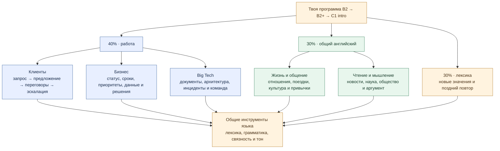
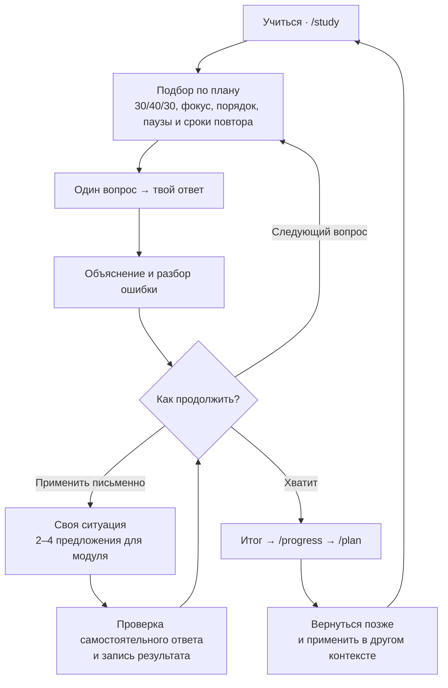
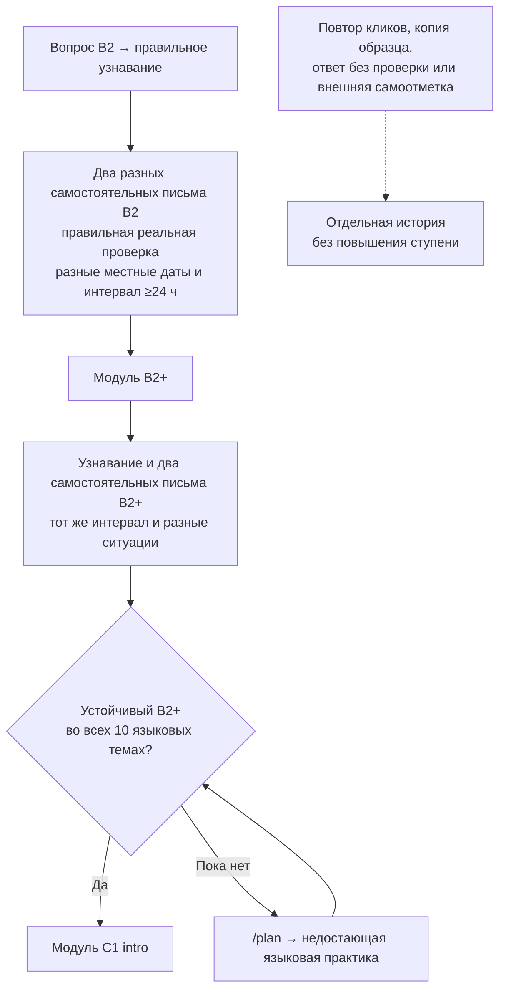
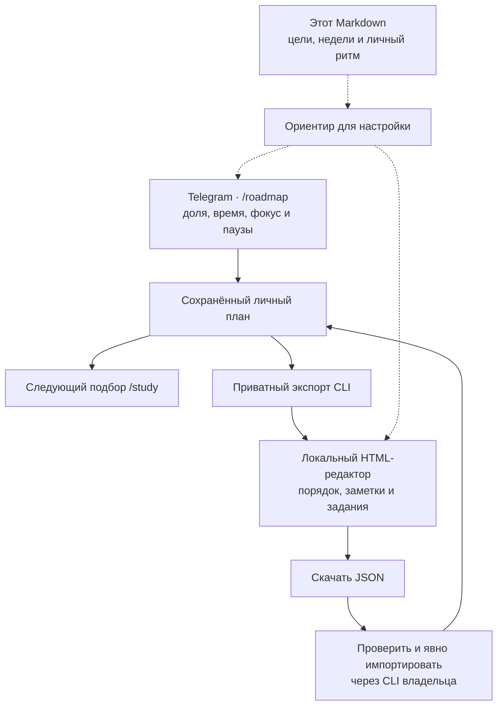

# Твоя программа английского: клиенты, бизнес и Big Tech

**30% — общий английский. 40% — твои рабочие темы. 30% — новые слова и выражения с повторением. Вводный C1 — усложнение доступных заданий после языкового порога.**

Цель — самостоятельно уточнять запрос клиента, объяснять решения, обсуждать
сроки и риски, договариваться и писать ясно. Общая часть поддерживает язык
для жизни, чтения, общения и аргументации. Точная должность и работодатель
не предполагаются: выбирай ситуации, которые нужны тебе сейчас.

**Начать:** `/study` → ответить → посмотреть объяснение → применить письменно.
**Настроить:** `/roadmap`. **Понять результат:** `/progress` и `/plan`.

[Редактор плана](workplace-planner.html) · [Скачать публичный план 30/40/30](client-work-plan.json) ·
[Лексическая программа](lexical-programme.md) · [Полный банк выражений](lexical-bank.md) ·
[Все модули и задания](workplace-roadmap.md) · [Инструкция по переносу плана](workplace-plan-guide.md) ·
[Как устроено обучение](../learning-methodology.md) ·
[Сравнение программ и основания улучшений](../research/curriculum-benchmark-2026-10.md)

## Схемы: как бот выбирает задания и подтверждает рост

- [Как работает ежедневный поток «Учиться»](study-flow-diagram.html): ученик и бот,
  подбор задания, A/B/C, разбор, «Хватит» и итог сессии.
- [Как модуль открывает следующий этап](evidence-gate-diagram.html): узнавание,
  два самостоятельных письма в разные дни и отдельный общий порог для C1 intro.

Обе схемы открываются отдельной HTML-страницей. На телефоне сохраняют ширину
и прокручиваются внутри страницы по горизонтали — текст не уменьшается до
нечитаемого размера.

## Чему учит бот



В полном каталоге **48 модулей: 32 рабочих и 16 общих**. Количество модулей
не задаёт долю занятий. Для нового плана выбран трек `client_facing` и
`general_share: 30`, `lexical_share: 30`; работа занимает остаток 40%.
Это три непересекающиеся части: рабочая тема лексического вопроса не даёт
ему второго зачёта в рабочей части. Существующий личный план сохраняет свои настройки,
пока ты явно их не изменишь.
Если поля `lexical_share` в нём ещё нет, оно нормализуется к 0%.

| Слой программы | Что в нём | Что получается на выходе |
| --- | --- | --- |
| Рабочие модули | Клиентские ситуации, международные команды, бизнес и IT | Понятный запрос, письмо, рекомендация, объяснение решения |
| Общие модули | Личная жизнь, общество, культура, чтение и повседневные решения | Рассказ, аргумент, отзыв, пересказ и разговор |
| Адаптивный язык | 10 тем: времена, будущее, условия, модальность, передача речи, структура информации, связность, дипломатия, рабочие сочетания, инциденты | Узнавание, перенос в новый контекст и самостоятельное применение |
| Лексический банк | Отдельные значения слов, сочетаний, фразовых глаголов и рамок для работы и жизни | Знакомство, позднее узнавание и собственное письмо — раздельные результаты |
| Личные материалы | Одобренные заметки с уроков, слова и исправления | Практика твоих фраз и ошибок; новые элементы добавляются после подтверждения |
| Вводный C1 | Неопределённость, несколько позиций, тон для сложной аудитории | Короткое точное решение с оговорками и следующим шагом |

В `/study` подключено **144 вопроса модулей и 300 коротких письменных ситуаций**.
У каждой ступени модуля есть два письменных варианта; у шести рабочих модулей
на вводном C1 — четыре. Отдельно сохраняются 270 адаптивных вопросов, включая
90 резервных проверок переноса, и 86 исходных языковых вопросов. Резервные
проверки остаются вне публичных образцов и обычной подготовки.

Лексический банк содержит **240 значений в 16 функциональных группах:
180 рабочих и 60 общих**. По два варианта узнавания и два письменных задания
на значение — всего **480 вопросов и 480 письменных ситуаций**. Для 20 единиц
выбрана метка вводного C1. Метки ступеней — авторское размещение в программе
и предполагаемая сложность задачи; это не откалиброванный уровень CEFR слов.

Большие задания каталога помогают тренировать чтение, аудирование, речь,
взаимодействие и передачу смысла. В Telegram проверяются текстовые ответы;
разговор и аудио требуют внешней практики. Самоотметка о ней видна отдельно.

По итогам сравнения учебных программ улучшены **36 больших кейсов в 12 модулях**:
теперь в них есть исходные факты, адресат, ограничения и конкретный результат.
Например, клиентское письмо требует сохранить неподтверждённый срок,
а разбор метрик — отличить изменение доли от доказательства причины.
Исследование объясняет [выбор улучшений и сравнение курсов](../research/curriculum-benchmark-2026-10.md).

## Как проходит одно занятие



Небольшое занятие тоже полезно: можно ответить на два вопроса и остановиться.
Письмо необязательно для продолжения ленты, но необходимо для подтверждения
продвижения модуля. Если проверка недоступна, ответ сохраняется без оценки.
У простого профиля нет автоматических учебных сообщений.

В ленте 30/40/30 означает целевую долю обычных отвеченных вопросов по трём частям;
прежняя языковая практика чередуется с модулями. Время ответа бот этой долей
не измеряет. Доступность и сроки повтора могут временно сдвинуть соотношение.
Фокус повышает приоритет доступной темы; уже открытый вопрос остаётся прежним.

## Ритм: 150 минут в неделю

Это редактируемый ориентир: **45 минут общего языка + 60 минут рабочих тем + 45 минут лексики**.
При меньшем времени сохраняй пропорцию, самостоятельный ответ и поздний повтор.
Увеличивай время чтения, письма и общения, когда можешь заниматься дольше.

| Касание | Общий язык | Работа | Лексика | Основное действие |
| --- | ---: | ---: | ---: | --- |
| 1 | 10 мин | 10 мин | 10 мин | `/study`, новые значения и свой короткий ответ |
| 2 | 5 мин | 15 мин | 10 мин | Рабочее письмо; вспомнить прежние выражения |
| 3 | 10 мин | 10 мин | 10 мин | Через ≥24 часа другая письменная ситуация |
| 4 | 5 мин | 15 мин | 10 мин | Сценарий встречи; другой лексический контекст |
| 5 | 15 мин | 10 мин | 5 мин | Общая тема, поздний повтор, итог и следующий фокус |
| **Всего** | **45 мин** | **60 мин** | **45 мин** | **150 минут** |

После выполнения языкового порога последние **15 рабочих минут** можно
отдать вводному C1: получится 45 минут рабочей B2/B2+ практики, 15 минут C1,
45 минут общего языка и 45 минут лексики. До открытия C1 используй эти минуты
для B2+. Общее время и три доли сохраняются.

Лексические 45 минут включают новое **и** закрепление. Разбор показывает
значение на русском и английском, пример, грамматическую рамку, регистр
и более простую формулировку. Начинай с небольшой порции новых значений;
возвращайся позже и пиши своё сообщение без копирования образца.
Два разных верных варианта через ≥24 часа на разных местных датах подтверждают
узнавание; два разных настоящих проверенных самостоятельных письма с тем же
интервалом — отдельный локальный результат применения.
В письменном задании целевое выражение дано: самостоятельность означает
собственный текст в предложенной ситуации, а не спонтанное извлечение без
подсказки. Эти результаты не открывают C1
и не заменяют доказательства модуля. [Содержание и ритм](lexical-programme.md),
[исследование](../research/workplace-lexical-learning.md) и
[банк с примерами](lexical-bank.md) доступны отдельно.

Для большого задания раз в неделю используй такой учебный цикл:
**короткий текст или диалог → заметить полезные формы → разобрать образец →
написать собственный ответ → получить обратную связь → позже выполнить другую
ситуацию без образца**. Это рекомендация к самостоятельной практике; кнопка
**Учиться** запускает описанную выше короткую ленту. После изучения образца
новый независимый результат выполняй в другом контексте, сохраняя границу
между подготовкой и проверкой.

## Гибкий план на 12 недель

Это последовательность фокусов, которую можно редактировать прямо в Markdown.
Неделя обозначает ориентир, а не срок открытия уровня. Один фокус может
занять несколько недель; бот выбирает ступень по результатам, а не календарю.
Таблица задаёт тематический маршрут, а точный порядок внутри него меняется
в `/roadmap` или редакторе. Выполняй результаты на английском и обезличивай
рабочие данные.

| Неделя / фокус | Твои темы — 60 мин | Общая часть — 45 мин | Самостоятельный результат |
| --- | --- | --- | --- |
| 1 · Понять собеседника | [Запрос клиента](workplace-roadmap.md#client_discovery), [уточнение](workplace-roadmap.md#clarification_repair) | [Отношения и границы](workplace-roadmap.md#identity_relationships) | Сформулировать 5 уточняющих вопросов и кратко подтвердить запрос; объяснить личную границу |
| 2 · Писать коротко и понятно | [Рабочие запросы](workplace-roadmap.md#async_requests), [статус](workplace-roadmap.md#stakeholder_updates) | [Планы](workplace-roadmap.md#social_plans), [бытовые услуги](workplace-roadmap.md#housing_services) | Письмо с целью, сроком и нужным действием; сообщение о бытовой договорённости |
| 3 · Запустить и согласовать | [Запуск проекта](workplace-roadmap.md#project_kickoff), [изменения требований](workplace-roadmap.md#requirements_changes) | [Истории и опыт](workplace-roadmap.md#life_stories) | Описать цель, границы и критерии приёмки; рассказать о событии с ясной хронологией |
| 4 · Обсуждать сроки и ограничения | [Приоритеты](workplace-roadmap.md#priorities_capacity), [оценки и обязательства](workplace-roadmap.md#estimates_commitments) | [Привычки](workplace-roadmap.md#wellbeing_habits), [обучение](workplace-roadmap.md#learning_education) | Объяснить компромисс и условную оценку срока; обосновать изменение привычки |
| 5 · Предложить ценность и договориться | [Предложение клиенту](workplace-roadmap.md#value_proposals), [переговоры](workplace-roadmap.md#commercial_negotiation) | [Покупки и деньги](workplace-roadmap.md#consumer_money) | Рекомендация с выгодой, условиями и альтернативой; сравнение потребительских вариантов |
| 6 · Возражать и решать конфликт | [Эскалация](workplace-roadmap.md#support_escalation), [несогласие](workplace-roadmap.md#persuasion_disagreement) | [Этические решения](workplace-roadmap.md#ethical_dilemmas) | Ответ недовольному клиенту с границами обещания; аргумент, учитывающий другую позицию |
| 7 · Участвовать во встрече | [Участие](workplace-roadmap.md#meeting_participation), [ведение встречи](workplace-roadmap.md#meeting_facilitation) | [Путешествия и культура](workplace-roadmap.md#travel_culture) | Повестка и итог с владельцами действий; устная репетиция с партнёром вне бота |
| 8 · Превратить данные в решение | [Метрики](workplace-roadmap.md#metrics_trends), [стратегия](workplace-roadmap.md#strategy_market) | [Новости](workplace-roadmap.md#news_media), [аргумент](workplace-roadmap.md#argument_decisions) | Подготовить краткий квартальный обзор для клиента (QBR): результат, ограничение, рекомендация и следующий шаг; пересказать позицию статьи |
| 9 · Объяснить сложное ясно | [Архитектура](workplace-roadmap.md#architecture_explanations), [технические документы](workplace-roadmap.md#technical_documents) | [Наука](workplace-roadmap.md#everyday_science), [цифровая жизнь](workplace-roadmap.md#digital_life) | Объяснить решение технической и нетехнической аудитории; доступный пересказ научной идеи |
| 10 · Говорить о риске без преувеличения | [Передача инцидента](workplace-roadmap.md#incident_handover), [разбор причин](workplace-roadmap.md#postmortems_improvement) | [Окружающая среда и выбор](workplace-roadmap.md#environment_choices) | Отдельно указать факты, неизвестное, воздействие и следующий шаг; взвесить личный выбор |
| 11 · Обратная связь и сотрудничество | [Один на один](workplace-roadmap.md#feedback_one_to_one), [межкультурный конфликт](workplace-roadmap.md#intercultural_conflict) | [Общество и участие](workplace-roadmap.md#society_civic) | Дать конкретную обратную связь и согласовать действие; сравнить общественные позиции |
| 12 · Собрать и применить | [Демо](workplace-roadmap.md#presentations_demos), [профессиональный опыт](workplace-roadmap.md#career_interviews) | [Книги, кино и отзывы](workplace-roadmap.md#arts_reviews) | Объяснить предложение новой аудитории без образца; написать отзыв; выбрать следующий слабый участок |

Ещё **45 минут каждой недели** отводи лексике по [отдельной программе](lexical-programme.md):
новые полезные значения, поздний повтор и самостоятельное сообщение.
Каждую неделю: один самостоятельный рабочий результат, один общий,
позднее возвращение к другой ситуации и проверка `/progress`.
Большой текст из таблицы полезен сам по себе; свидетельство конкретного
модуля бот записывает через предложенное письменное задание этого модуля.

Для связного клиентского кейса используй одну вымышленную ситуацию:
выявление запроса → предложение → переговоры → согласование поставки →
работа с инцидентом → квартальный обзор результатов. Возвращайся к ней
на соответствующих неделях. Отдельную проверку переноса выполняй на другой
ситуации: знакомый кейс сам по себе не доказывает независимого применения.

Остальные рабочие модули остаются доступны. Подключай их по ситуации:

| Когда нужно | Модули |
| --- | --- |
| Представить роль или распределить ответственность | [Профессиональное знакомство](workplace-roadmap.md#professional_identity), [делегирование](workplace-roadmap.md#delegation_coaching) |
| Обосновать бюджет и эффект | [Ресурсы](workplace-roadmap.md#budgets_resources), [бизнес-обоснование](workplace-roadmap.md#financial_case) |
| Обсудить эксперимент или AI | [Исследования](workplace-roadmap.md#research_experiments), [автоматизация](workplace-roadmap.md#ai_automation) |
| Разобрать ограничения и изменение процесса | [Безопасность](workplace-roadmap.md#security_privacy), [принятие изменений](workplace-roadmap.md#change_adoption) |

## Небольшая добавка C1

На вводном C1 тренируется более точная мысль: учитывать противоречия,
ограничивать вывод, выбирать тон под аудиторию и предлагать проверяемый шаг.
Усложнение не сводится к длинным предложениям или редким словам.

| Рабочая тема | Фокус вводного C1 |
| --- | --- |
| `commercial_negotiation` | Условия уступки, границы обязательства и взаимная выгода |
| `support_escalation` | Ответ при неполных данных, ясное обещание следующего действия |
| `stakeholder_updates` | Разные интересы адресатов, факт и прогноз, точность статуса |
| `strategy_market` | Синтез позиций, ограниченная рекомендация и критерий проверки |
| `architecture_explanations` | Компромиссы и объяснение с учётом знаний аудитории |
| `incident_handover` | Разделение факта и гипотезы, влияние и оперативная передача |

Эти шесть тем получили **12 дополнительных письменных ситуаций C1**:
по два новых контекста к прежним двум. Для чтения цели и большого задания
достаточно, например, `/roadmap module strategy_market c1_intro`.
Предварительный просмотр доступен до открытия ступени. Внешнюю репетицию
можно сделать заранее, но она не засчитывается как проверенное освоение.

## Что считается прогрессом



Два результата должны относиться к **разным письменным ситуациям одной
ступени**. Повтор своего ответа, готового образца или переписанного ботом
текста не даёт второго подтверждения. Одни кнопочные ответы не доказывают
самостоятельное применение. Ошибки подсказывают, что повторить.

`/progress` отделяет узнавание, независимое письмо, темы языка и модули.
`/plan` показывает следующий адаптивный языковой шаг; `/roadmap` — личный
план и недостающие результаты модулей. В полном режиме `/baseline` и
`/outcomes full` дают дополнительные признаки активного языка и удержания.
Эти показатели направляют обучение; сертификат CEFR и переход за 12 недель
программа не обещает. Произношение и живой разговор текстовый бот не оценивает.

## Где менять план



Для новой настройки в Telegram:

```text
/roadmap activate
/roadmap track client_facing
/roadmap general 30
/roadmap lexical 30
/roadmap time 150
/roadmap focus client_discovery
/roadmap pause budgets_resources
/roadmap resume budgets_resources
```

Если ты уже расставил собственный порядок, изменение трека восстановит
рекомендованный порядок этого трека. Меняй только нужные параметры.
Можно выбрать `big_tech`, сохранив долю общего языка 30%.

Для браузера скачай [редактор](workplace-planner.html), открой локально и
импортируй [публичную копию плана 30/40/30](client-work-plan.json). Она содержит
исходные настройки без личных ответов и заметок. Для редактирования текущего
профиля сначала нужен его приватный экспорт, иначе ты меняешь исходный план.

| Поле переносимого JSON | Что редактировать |
| --- | --- |
| `track` | `client_facing`, `big_tech` или `balanced` |
| `weekly_minutes` | Общее время: 30–1200 минут |
| `general_share` | Доля общего языка: здесь 30; допустимо 20–90 |
| `lexical_share` | Доля лексики: здесь 30; допустимо 0–60; вместе с общей не выше 90, работа — остаток |
| `order` | Порядок всех 48 существующих ID; каждый должен остаться ровно один раз |
| `focus` | Один активный ID или `null` |
| `paused` | Временно исключённые ID; оставь активные темы обоих направлений |
| `notes` | Личные уточнения по ID; до 1000 символов на модуль |
| `version` | Формат плана: оставь `1` |

**Markdown и локальный редактор не синхронизируются с Telegram автоматически.**
Правка этого файла меняет описание программы. Правка в Telegram меняет
профиль сразу; JSON из редактора начинает влиять на бот после явного импорта.
Команды экспорта, проверки и применения есть в
[инструкции](workplace-plan-guide.md#4-перенести-между-файлом-и-профилем).
История и уже открытый вопрос сохраняются. Личные экспорты и рабочие заметки
храни приватно, например в `data/`, и не добавляй в публичный репозиторий.

## Личная правка программы

Скопируй блок в личные заметки и меняй по мере практики:

```text
Мой недельный бюджет: 150 минут.
Доля: общий язык 30%, работа 40%, лексика 30%.
Текущий рабочий фокус: client_discovery.
Текущий общий фокус: identity_relationships.
Ближайший самостоятельный результат: ...
Что мешало выразить мысль: ...
К чему вернуться через ≥24 часа: ...
C1: до открытия — B2+; после открытия — до 15 рабочих минут.
Что изменить в /roadmap или JSON: ...
```

Этот документ редактируется вручную. Каталог и HTML-редактор генерируются из
[публичной программы](../../src/fluentloop/seeds/workplace_curriculum_v1.json);
проверенный банк коротких заданий хранится
[отдельно](../../src/fluentloop/seeds/roadmap_question_pack_v1.json).
Лексический банк редактируется в
[`workplace_lexicon_v1.json`](../../src/fluentloop/seeds/workplace_lexicon_v1.json),
а читаемое представление — [здесь](lexical-bank.md). Проверка и обновление
описаны в [лексическом runbook](../runbooks/lexical-learning.md).
После изменения этих источников пересоздавай представления по
[инструкции](workplace-plan-guide.md#7-как-менять-сам-публичный-учебный-план).
