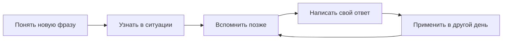

# Новые слова и выражения: 30% твоей программы

**План: 30% общий английский + 40% рабочие ситуации + 30% новая лексика.**
Лексическая часть помогает понимать и самостоятельно использовать полезные
слова, фразовые глаголы, сочетания и речевые рамки: например, *push back on*,
*follow up on*, *raise a concern*, *a trade-off*.

Это учебная рекомендация на основе [исследования](../research/workplace-lexical-learning.md).
Общее устройство занятий и актуальные возможности бота описаны в
[основной программе](learning-programme.md). Доли считаются по трём отдельным
частям: лексическое задание о клиенте относится к 30% лексики и повторно в
40% работы не учитывается. Все три части вместе составляют 100%.

## Что именно учить

Первая рекомендуемая редакция банка — **240 отдельных значений и конструкций
в 16 группах**. Большая часть связана с клиентами, бизнесом и технологиями;
есть и общий словарь для жизни. Эти числа описывают объём содержания, а не
обещание выучить всё сразу. Каждая новая единица должна иметь понятное значение,
пример, грамматическую рамку и объяснение того, где она уместна.

| Рабочая задача | Что станет легче делать |
| --- | --- |
| Потребность клиента | Уточнить проблему, ограничения и ожидаемый результат |
| Понимание и объяснение | Проверить смысл, переформулировать, объяснить по шагам |
| Статус и продолжение | Сообщить о прогрессе, вернуться к запросу |
| Несогласие | Возразить с причиной и предложить альтернативу |
| Переговоры | Обсудить объём, сроки и условия |
| Приоритеты | Объяснить выбор между конкурирующими целями |
| Решения | Сопоставить варианты и запросить одобрение |
| Ответственность | Передать задачу и договориться о следующем действии |
| Риск и инцидент | Разделить факт, влияние, неизвестное и план восстановления |
| Данные | Объяснить наблюдение и ограничения вывода |
| Обратная связь | Назвать поведение, эффект и конкретную просьбу |
| Техническое изменение | Объяснить запуск, зависимость и изменение простым языком |

Общая часть словаря охватывает **личные планы, отношения, бытовые проблемы,
мнения и обучение**. Одно выражение может пригодиться в разных областях:
*put off* — и для рабочей встречи, и для личной поездки. Повтор в другом
контексте помогает переносу; это не ещё одно новое слово.

## Как выглядит хорошая единица

**Push back on a proposal — возразить против предложения.**
Авторский пример: *I'd like to push back on the proposed deadline because
the review needs two more days.*

- Рамка: `push back on + то, с чем не согласен`.
- Цель: обозначить возражение, объяснить причину, предложить следующий шаг.
- Альтернатива для более спокойного клиентского письма: *I have a concern
  about the timing. Could we allow two more days for the review?*
- Другое значение: `push a deadline back` — перенести срок **позже**;
  с местоимением — `push it back`.

Oxford различает эти значения и отмечает преимущественно североамериканское
употребление сопротивления *push back on*. Сам пример и рекомендация по тону
здесь авторские. [Oxford: push back](https://www.oxfordlearnersdictionaries.com/definition/english/push-back)

Полезно понимать рабочие идиомы, но писать клиенту можно проще.
Например, в международной технической документации Google рекомендует
избегать идиом и сленга ради ясности. Поэтому цель — выбирать подходящую
формулировку для адресата. [Google: global audience](https://developers.google.com/style/translation)

## Как заниматься

Сначала разбери значение, пример и конструкцию. Затем проверь понимание в
ситуации. При следующем возвращении попробуй вспомнить выражение до просмотра
подсказки. Напиши короткое собственное сообщение, а позже примени тот же смысл
к другой задаче. Для разговора добавь устный пример вне Telegram.

**Новая лексика включает закрепление.** Если каждый раз брать только новые
слова, знакомых названий станет много, а свободное употребление может отстать.
Если неделями повторять только старое, словарь не расширится. Поэтому следи
за двумя результатами отдельно: «с какими значениями познакомился» и
«какие удалось вспомнить или применить позже».

Верный выбор из вариантов означает узнавание. Собственное предложение с
только что показанной фразой — применение с опорой. Более сильный результат —
самостоятельный ответ в новой ситуации без образца, затем ещё один в другой
день. Непроверенный ответ или самоотметка «использовал на встрече» сохраняют
свою ценность, но не заменяют проверенное свидетельство.

В текущих письменных заданиях бот называет нужное выражение, а сообщение
ты составляешь сам, без готового образца и определения. Поэтому результат
означает проверенное применение **с заданным выражением**. Он ещё не доказывает,
что фраза сама вспомнится в разговоре. Для такой проверки попробуй позднее
решить похожую задачу без названия фразы; это дополнительная практика.

## Ритм на 150 минут в неделю

При таком режиме получится **45 минут общего английского, 60 минут рабочих
ситуаций и 45 минут лексики**. Время можно менять; это ориентир для собственного
расписания, а не таймер, который автоматически измеряет бот.

| Занятие | Общий язык | Работа | Лексика | Лексическое действие |
| --- | ---: | ---: | ---: | --- |
| 1 | 10 мин | 10 мин | 10 мин | Познакомиться с 2–3 полезными значениями |
| 2 | 5 мин | 15 мин | 10 мин | Вспомнить прежнее, добавить небольшую порцию нового |
| 3 | 10 мин | 10 мин | 10 мин | Написать собственный ответ и разобрать трудность |
| 4 | 5 мин | 15 мин | 10 мин | Другой контекст; при готовности ещё немного нового |
| 5 | 15 мин | 10 мин | 5 мин | Поздний повтор, итог и выбор следующего фокуса |
| **Всего** | **45 мин** | **60 мин** | **45 мин** | **150 минут** |

Стартовый ориентир — **6–10 новых значений в неделю**; при 90 минутах всей
программы — **3–5**. Это предложение для первых двух недель, а не обязательная
норма и не доказанный максимум. Если знакомое трудно вспомнить, уменьшай
новую порцию и сохраняй повторение. Если многое уже известно, переходи к
новым значениям и более самостоятельным ситуациям.

На первом знакомстве с 240 единицами при темпе 6–10 в неделю арифметически
получается 24–40 недель. Самостоятельное владение формируется постепенно;
реальное время зависит от исходного словаря и возвращений к материалу.

## Очерёдность, которую можно менять

Это четыре прохода, а не жёсткие календарные блоки. В каждом оставляй общую
лексику и повтор ранее изученного. Начни с функций, нужных на ближайшей неделе.

| Проход | Основной фокус | Свой итог |
| --- | --- | --- |
| 1. Понятное взаимодействие | Уточнения, статус, личные планы, бытовые проблемы | Короткий запрос и понятный следующий шаг |
| 2. Границы и выбор | Несогласие, переговоры, приоритеты, мнения | Возражение с причиной и реалистичной альтернативой |
| 3. Совместная работа | Ответственность, решения, обратная связь, отношения | Передача задачи и договорённость без двусмысленности |
| 4. Точность в сложной ситуации | Данные, риск, технические изменения | Рекомендация с ограничением и адаптацией для адресата |

Можно переставлять фокус, приостанавливать ненужные темы и менять учебное
время. Сохраняй контекст задачи: например, «спокойно обсудить нереальный срок»,
а не «выучить десять сложных слов». Реальные имена клиентов и конфиденциальные
детали для тренировочного примера не нужны.

## Как понимать уровень и прогресс

На B2 задача — передать нужный смысл и построить подходящую конструкцию.
На уверенном B2 — сделать это без образца в новой ситуации и с несколькими
ограничениями. Вводный C1 добавляет неоднозначность, разные интересы и более
точный выбор тона. Это сложность задания, а не присвоение уровня каждому слову.
Метки этапов в начальном банке — редакционный ориентир; их трудность ещё
не откалибрована по результатам учеников.

Изучение списка не открывает C1 автоматически. Существующий языковой порог
и требования независимого применения сохраняются. Бот проверяет текст;
аудирование, произношение и живое взаимодействие требуют отдельной практики.
Результаты курса показывают освоение его задач, а не сертификацию CEFR.

Через две недели оцени три вещи: появились ли полезные новые значения;
удаётся ли вспомнить их позже; удаётся ли написать своё сообщение без образца.
Если растёт только число просмотренных карточек, добавь самостоятельное
применение и скорректируй новую порцию.

Основания выбора содержания, интервальной практики и критериев результата
собраны в [полном исследовании](../research/workplace-lexical-learning.md).
