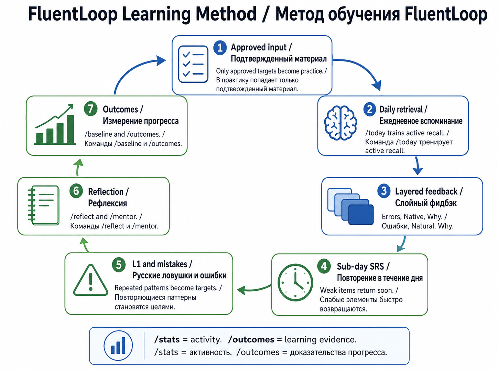
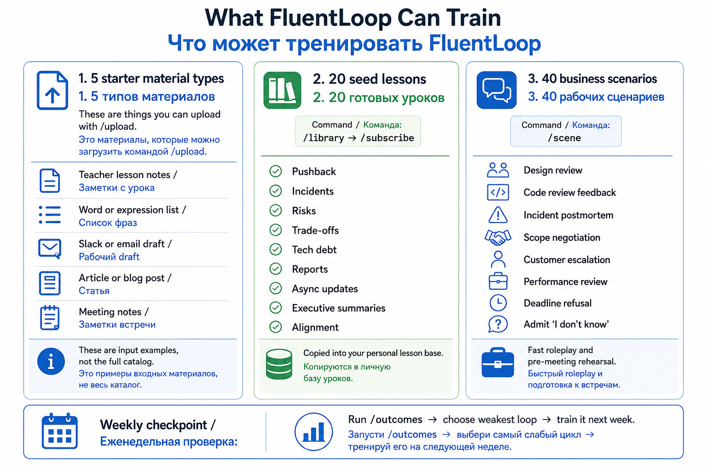

# FluentLoop Learning Methodology / Методология обучения FluentLoop

FluentLoop превращает материал и реальные ситуации в учебный цикл для B2,
сильного B2 и вводного C1: вспомнить язык, самостоятельно применить его,
получить разбор и позже проверить перенос в другой контекст.

**Персональная программа: 30% общий английский, 40% клиенты, бизнес и Big Tech,
30% новые слова и выражения вместе с их повторением.** Это три отдельные части:
лексический ответ с рабочей темой не засчитывается повторно как рабочий.
Общие темы сохраняют языковую основу. [Программа на 12 недель со схемами](curriculum/learning-programme.md)
показывает реальные модули, задания, ритм и настройки. Вводный C1 добавляется
небольшими задачами после выполнения прежнего языкового порога.



## Простая практика

Пилот скрывает выбор lesson type и practice mode из ежедневного запуска:
`/study` → один вопрос → ответ кнопкой → короткое объяснение → следующий вопрос.
Варианты ответа всегда напечатаны в самом сообщении, а кнопки содержат только
**A**, **B** и **C**, поэтому длинные рабочие формулировки остаются читаемыми
на телефоне.
**Хватит** завершает занятие и показывает точность текущей сессии, доли общей,
рабочей и лексической частей и ближайшее действие по затронутым модулям. Из итога доступны **Прогресс**
и **План**; полный прогресс остаётся отдельным экраном, чтобы сессионный результат
не выглядел как подтверждение уровня. Короткое письмо (обычно 1–2 предложения)
доступно после итога по желанию. Автоматических учебных сообщений у простого профиля нет.

Лента смешивает одобренные фразы и грамматику, включая проверенный набор
lang-lessons. Правильное узнавание имеет суточную паузу перед следующим
обычным повтором; ошибка возвращается после пяти других ответов. Исчерпание
подходящего банка предлагает досрочное повторение явно.

Узнавание и самостоятельное использование — разные свидетельства:
`/progress` показывает их отдельно; кнопочные ответы не учитываются в
productive chunks, writing, productive held-out retention или extinction.
Для активного использования доступны необязательное письмо и полные уроки.
Если проверка письма недоступна, ответ сохраняется без оценки и не даёт
свидетельства освоения темы.

По каждой теме `/progress` показывает этап B2, B2+ или вводный C1 и отдельные
счётчики практики, переноса в новом контексте и самостоятельного письма.
`/plan` выбирает следующий шаг по сохранённым ответам и указывает пробелы.
Успех в знакомом вопросе сам по себе не означает перехода: нужен отложенный
повтор и свежий контекст, а на B2+/C1 — собственное предложение. Ошибки могут
вернуть тему к отработке. Вводный C1 открывается после устойчивого B2+ по всем
темам. Эти этапы направляют практику и не удостоверяют уровень CEFR.

Банк может пополняться новыми вариантами только в пределах уже одобренных
тем, с ограничениями на объём для профиля и исходного вопроса. Варианты
проходят независимую проверку и проверку структуры до включения; непрошедшие
остаются вне практики. Кнопка **Ошибка в вопросе** после ответа исключает
личный вопрос из подбора до проверки, сохраняя исходный материал и историю
ответов. Вариант из прежнего проверенного набора может быть заменён после
проверки без изменения исходного уровня или зачёта как доказательства B2.
Произвольные личные карточки и авторские вопросы широкого плана автоматически
не заменяются; их жалобы сохраняют личное исключение вопроса.

Общая программа шире адаптивного банка: чтение, аудирование, письмо, речь,
взаимодействие и передача смысла в личных, общественных и рабочих ситуациях.
`/roadmap` и [редактор](curriculum/workplace-plan-guide.md) задают приоритеты
практики; `/progress` отражает только собранные свидетельства. Новый план
получает 30% общего языка, 40% рабочих тем и 30% лексики, трек `client_facing`.
При ориентире 150 минут это 45 общих, 60 рабочих и 45 лексических; до 15 рабочих минут
можно выделить на C1 после его открытия. Сохранённые планы сохраняют свои
параметры до явной правки.
Сохранённый план управляет тремя долями вопросов, порядком, фокусом
и паузами в `/study`. Старый вопрос сохраняется до ответа. Модуль продвигается
после узнавания и двух независимо проверенных письменных ситуаций на разных
местных датах с интервалом не меньше 24 часов. Это разные ситуации одной
ступени с правильными самостоятельными ответами; для C1 дополнительно нужен
прежний языковой порог. Копии и непроверенные ответы не дают такого свидетельства.
Внешние самоотметки практики остаются отдельно. Доля вопросов не измеряет время:
минуты плана — рекомендованный ритм. Изменения плана не присваивают уровень.
Методические основания и ограничения: [исследование](research/b2-c1-framework.md).

## Расширение словаря: значение, повтор и самостоятельный ответ

Лексический банк в `/study` учит отдельным значениям и конструкциям: одна
форма с двумя смыслами не считается одной универсальной карточкой.
Разбор даёт русское и английское значение, авторский пример, грамматическую
рамку, регистр и простую альтернативу. Он помогает выбирать формулировку
для адресата, а не вставлять идиомы в каждый текст.

Внутри 30% лексики есть первое знакомство и позднее извлечение. При наличии
обоих доступных пулов они чередуются. Повтор после успеха ждёт минимум
24 часа и новую местную дату; ошибка ждёт пять других отвеченных вопросов.
Варианты одного значения делят это ограничение. Недоступный пул не даёт
основания показывать досрочный повтор без явного выбора знакомой практики.

Два разных верных распознавания через ≥24 часа на разных местных датах
подтверждают **узнавание значения**. Два разных собственных письменных ответа
с настоящей верной проверкой и тем же интервалом подтверждают отдельный
локальный результат самостоятельного применения. Повторы текста, образцы,
выбранные ответы, исправления модели, fallback без проверки и знакомая
практика исключены. Эти результаты не подменяют доказательства модуля или
адаптивной темы; прежний порог C1 сохраняется.

Письменные задания явно дают целевое выражение. «Самостоятельное применение»
означает собственный текст в заданной ситуации с этой опорой; оно не доказывает
спонтанного извлечения фразы без подсказки. Метки ступеней — авторское
размещение заданий в программе, а не откалиброванные уровни CEFR выражений.

`/roadmap lexical 30` включает эту часть в старом плане. План без поля
`lexical_share` нормализуется к нулю и не меняет прежнее распределение.
Числа описывают отвеченные обычные вопросы, не время и не необязательное письмо.
В `/progress` знакомство, узнавание и независимое письмо показаны раздельно.
Жалоба исключает значение только у этого ученика, без изменения общего банка.

Содержание можно читать и редактировать по [лексической программе](curriculum/lexical-programme.md),
[банку](curriculum/lexical-bank.md) и [инструкции](runbooks/lexical-learning.md).
[Исследование](research/workplace-lexical-learning.md) отделяет научные основания
интервального извлечения от проектных долей и порогов; они не являются нормами CEFR.

## Что происходит после твоего ответа

| Шаг | Действие бота | Что это даёт |
| --- | --- | --- |
| Подбор | Учитывает сохранённый план, ступень, сроки повтора и доступность | Практика следует приоритетам; текущий вопрос остаётся после правок |
| Выбор ответа | Сохраняет результат и показывает объяснение | Свидетельство узнавания, повторение слабого места |
| Письменное применение | Даёт ситуацию модуля на 2–4 собственных предложения | Отдельная проверка активного языка |
| Поздний повтор | Предлагает другой контекст; отслеживает интервал и независимость | Проверка использования через время |
| Прогресс | Разделяет узнавание, самостоятельное письмо и внешние самоотметки | Следующий шаг опирается на результаты |

Для всех 48 модулей доступны 144 вопроса и 300 письменных ситуаций.
Дополнительные 12 ситуаций расширяют вводный C1 в переговорах, эскалациях,
статусах, стратегии, объяснении архитектуры и передаче инцидента.
Банк из 270 адаптивных вопросов остаётся отдельным: 90 заданий переноса
держатся вне обычной подготовки и публичных примеров. Языковой порог
вводного C1 требует устойчивого B2+ по всем десяти адаптивным темам.

Просмотр `/roadmap module <id> c1_intro` показывает цель и большой сценарий
до открытия C1. Он не снимает порог выдачи вопросов. Аудио, произношение и
живое взаимодействие требуют внешней практики; её самоотметка не подтверждает
качество. Редактор работает локально: экспорт JSON влияет на Telegram после
явного импорта. Подробные схемы цикла и продвижения есть в
[персональной программе](curriculum/learning-programme.md).

## Полный режим: короткая версия

```text
input -> lesson type -> practice mode -> exercise type -> feedback ->
SRS/mistakes -> outcomes -> next focus
```

На практике это значит:

1. **Input.** Ты приносишь материал через `/upload` или берешь shared lesson
   через `/library` -> `/subscribe`.
2. **Lesson type.** Система понимает, что тренируется: vocabulary, chunks,
   grammar, mistakes, diplomatic tone, notebook, reading, writing, genre,
   scenario, review, mixed lesson или outcomes.
3. **Practice mode.** Ты тренируешься через `/today` или focused commands:
   `/practice notebook`, `/practice diplomatic`, `/practice vocab`,
   `/practice mistakes`, `/article`, `/scene`, `/translate_lab`.
4. **Exercise type.** Урок превращается в recall, cloze, rewrite, chunk builder,
   mini writing, register choice, active recall и другие конкретные задания.
5. **Feedback.** Ответ проверяется слоями: `Errors`, `Native`, `Why`.
6. **Memory and mistakes.** SRS, confidence, Russian L1 traps и mistake patterns
   решают, что должно вернуться.
7. **Outcomes.** `/baseline` и `/outcomes` показывают не активность, а учебные
   признаки: retention, productive chunks, L1 density, writing metrics,
   mistake extinction, reading probes.

## Что отличается от обычного бота с упражнениями

Обычный drill-бот часто делает одно: дает вопрос и проверяет правильность.
FluentLoop держит несколько учебных механизмов одновременно.

| Механизм | Зачем нужен | Команды |
|---|---|---|
| Approved input | Не тренировать мусор: новые targets попадают в практику только после approve | `/upload`, `/approve` |
| Daily retrieval | Доставать язык из памяти, а не перечитывать список | `/today`, `/review` |
| Layered feedback | Разделить ошибки, natural rewrite и объяснение причины | feedback buttons after answer |
| Sub-day SRS | Быстро вернуть слабое место, пока оно еще в рабочей памяти | `/today`, `/review` |
| Mistake/L1 loop | Превратить повторяющиеся русские transfer errors в targets | `/practice mistakes`, `/translate_lab` |
| Reflection | Понять, где английский реально мешал в работе | `/reflect`, `/mentor` |
| Outcomes | Еженедельно выбирать самый слабый учебный цикл | `/baseline`, `/outcomes full` |

## Lesson Types

Lesson Type - это единый learner-facing слой. Он отвечает на вопрос:
**что именно тренирует этот урок и куда идти дальше**.

Полная актуальная таблица генерируется из code registry:
[`lesson-catalog/lesson-types.md`](lesson-catalog/lesson-types.md).

Главные типы v1:

| Type | Что тренирует | Основные команды |
|---|---|---|
| Vocabulary | слова и термины, которые нужно recall | `/practice vocab`, `/review` |
| Chunks | collocations и reusable workplace phrases | `/practice vocab`, `/practice notebook` |
| Grammar | формы, tense, articles, prepositions, sentence shape | `/practice grammar`, `/practice mistakes` |
| Mistake Repair | повторяющиеся ошибки и L1 traps | `/practice mistakes`, `/translate_lab` |
| Diplomatic | pushback, disagreement, feedback, hedging, tone | `/practice diplomatic`, `/scene`, `/translate_lab` |
| Notebook | free writing для native diff, chunk mining, L1 checks | `/practice notebook`, `/reflect` |
| Reading | claim, assumption, hedge marker, executive summary | `/article`, `/practice reading` |
| Writing | workplace artifacts: email, report, update, review, resume | `/practice writing`, `/baseline` |
| Genre | структура рабочих документов | `/practice genre`, `/practice writing_workshop` |
| Scenario | roleplay и pre-meeting rehearsal | `/scene`, `/brief` |
| Review | SRS, retention, cold recall | `/today`, `/review` |
| Mixed | широкие уроки из seed/textbook/upload materials | `/lesson <id>`, `/today` |
| Outcomes | измерение прогресса и выбор следующего фокуса | `/baseline`, `/outcomes`, `/mentor` |

## Material Types vs Lessons vs Scenarios



Эти сущности похожи, но у них разная роль:

1. **Material types для `/upload`.** Это то, что ты приносишь сам: teacher
   notes, phrase list, Slack/email draft, article/blog post, meeting notes,
   homework. Они приватные и становятся practice targets только после approve.
2. **Shared lesson plans для `/library`.** Это public templates. После
   `/subscribe <template_id>` урок копируется в твою личную базу, а прогресс
   остается приватным.
3. **Scenario cards для `/scene`.** Это 40 code-defined business/IT roleplay
   ситуаций: design review, code review, incident postmortem, scope negotiation,
   customer escalation, deadline refusal и т.д.
4. **Focused modes для `/practice`.** Это режимы тренировки поверх твоей базы:
   notebook, diplomatic, vocab, mistakes, reading, genre, writing workshop.
5. **Outcome reports.** `/baseline` задает стартовую точку, `/outcomes` говорит,
   какой учебный loop слабее всего сейчас.

## Как выбрать режим

| Симптом | Что делать |
|---|---|
| Не знаешь, с чего начать | В пилоте `/study`; для полного пути `/library` -> `/subscribe`, потом `/baseline` и урок |
| Есть заметки с урока | `/upload` -> `/approve` -> `/today` |
| Много пассивных фраз, но мало active use | `/practice notebook`, `/practice vocab` |
| Звучишь слишком прямо или по-русски | `/practice diplomatic`, `/translate_lab` |
| Повторяются одни ошибки | `/practice mistakes`, `/review` |
| Нужно подготовиться к встрече | `/brief <agenda>`, `/scene <topic>` |
| Нужно читать и суммировать статьи | `/article <text>`, `/practice reading` |
| Хочешь понять прогресс | `/outcomes full` |

## Public catalog

Текущий публичный каталог генерируется автоматически и лежит здесь:

- [All public learning surfaces](lesson-catalog/index.md)
- [Lesson types](lesson-catalog/lesson-types.md)
- [B2/B2+ seed lessons](lesson-catalog/b2-b2plus-seed.md)
- [English for Tech](lesson-catalog/english-for-tech.md)
- [Business/IT scenarios](lesson-catalog/scenarios.md)

Source of truth: SQLite/code. Markdown/HTML файлы в `docs/lesson-catalog/` -
это export view. Их не нужно редактировать руками.

## Compact EN

FluentLoop uses a measurable learning loop, not random drills:

```text
approved input -> lesson type -> practice mode -> exercise -> feedback ->
SRS/mistakes -> outcomes -> next focus
```

Bring material with `/upload` or clone a shared lesson via `/library` and
`/subscribe`. Train with `/today` and focused practice modes. Check layered
feedback (`Errors`, `Native`, `Why`). Let SRS and mistake patterns return weak
items. Use `/baseline` and `/outcomes full` weekly to choose the next focus.
