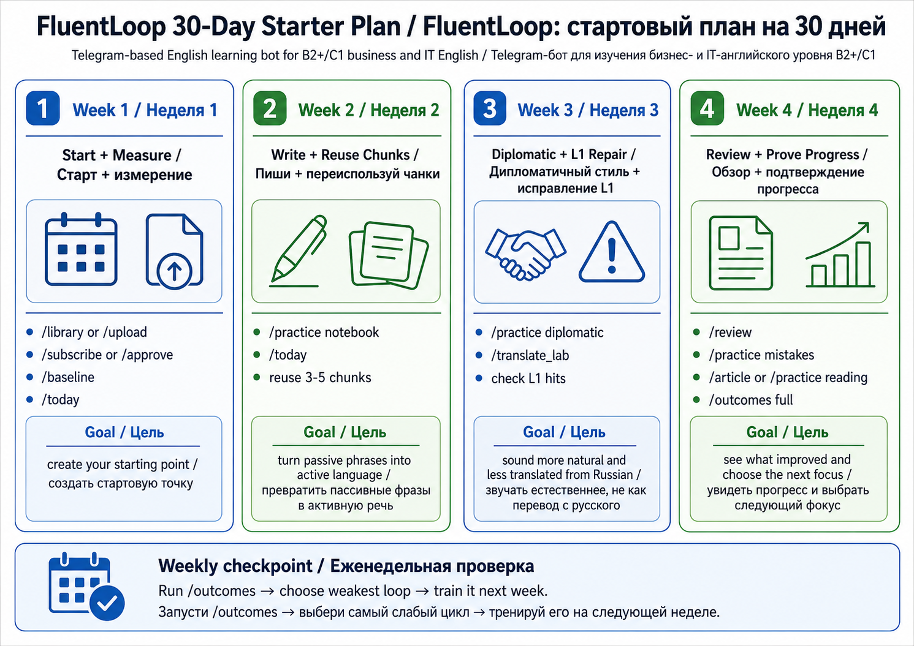

# FluentLoop Learning Plans / Учебные планы

Этот документ отвечает на практический вопрос: что делать каждый день, чтобы
FluentLoop помогал в общем английском и нужных рабочих ситуациях.

**Текущая персональная программа — 30% общий английский, 40% клиенты,
бизнес и Big Tech, 30% новые слова и выражения с повторением.** Полный редактируемый маршрут на 12 недель, схемы
обучения, конкретные результаты и небольшая добавка вводного C1 находятся в
[твоей программе](curriculum/learning-programme.md).

| Задача | Где начать |
| --- | --- |
| Понять, чему учит бот и как устроен прогресс | [Программа со схемами](curriculum/learning-programme.md) |
| Коротко позаниматься сейчас | `/study` или **Учиться** |
| Настроить 30/40/30, темы и время | `/roadmap general 30`, `/roadmap lexical 30`, `/roadmap time 150`, `/roadmap focus client_discovery` |
| Переставить модули и сохранить переносимую копию | [Редактор](curriculum/workplace-planner.html) и [публичный JSON](curriculum/client-work-plan.json) |
| Выбрать новые слова и повторения | [Лексическая программа](curriculum/lexical-programme.md) и [банк](curriculum/lexical-bank.md) |
| Узнать следующий шаг и подтверждённый результат | `/plan`, `/progress`, `/roadmap` |

При 150 минутах в неделю: 45 минут общего языка, 60 минут рабочих тем и 45 минут лексики.
После открытия вводного C1 до 15 из рабочих минут можно отдать сложным
клиентским и командным ситуациям. Это ориентир времени; в `/study` доля
направлений распределяет обычные отвеченные вопросы по трём отдельным частям.
Новые слова и их поздние повторы входят в одни 30%; рабочий контекст слова
не прибавляет его к рабочим 40%. Существующие личные планы сохраняют
свои параметры, пока их явно не изменят.

Методология целиком описана в [learning-methodology.md](learning-methodology.md).
Текущие lesson types и публичные уроки лежат в
[lesson-catalog/index.md](lesson-catalog/index.md).

Основная логика:

```text
start simple -> produce English -> get feedback -> repeat weak points ->
measure outcomes -> choose next focus
```

## Простой план без расписания

Широкий редактируемый план B2–C1 intro находится в
[твоей программе](curriculum/learning-programme.md) и
[руководстве по настройке](curriculum/workplace-plan-guide.md): 16 общих и 32
рабочих модуля, `/roadmap`, редактор с экспортом JSON и
настраиваемое распределение времени. Новый план использует рабочий трек
`client_facing`, 30% общего языка и 30% лексики. Старый план без `lexical_share`
сохраняет 0% до явного изменения. Сохранённый план управляет подбором
**Учиться**: общая база, рабочие дополнения и лексика распределяются по заданным долям,
с учётом фокуса, пауз и доступности. Общий английский поддерживает языковую
основу. Markdown и браузерный редактор не синхронизируются с ботом автоматически:
правки из редактора нужно явно применить к профилю через JSON.
Планы ниже сохраняются как дополнительные варианты практики в полном режиме,
а не обязательный календарь или настройки подбора вопросов.

В пилоте достаточно нажать **Учиться**, отвечать кнопками и остановиться по
**Хватит**. Лента подбирает фразы и грамматику сама. Можно ответить на два
вопроса или на двадцать: обязательного объёма нет и бот не напоминает сам.
При желании после итога нажми **Применить письменно** и выполни короткое задание
на 1–2 собственных предложения. После вопроса модуля плана доступна отдельная
письменная ситуация на 2–4 предложения. Через сутки вернись к другой ситуации
той же ступени: два разных самостоятельных правильных письменных результата
на разных местных датах с интервалом ≥24 часа вместе с правильным выбором
в вопросе этой ступени подтверждают переход модуля.
`/progress` показывает узнавание и письмо отдельно, а также прогресс по темам.
Открой `/plan` или **Ещё → План**, чтобы увидеть текущую тему и следующий шаг.
В течение недели возвращайся к ней после интервала: знакомый ответ ещё не
доказывает перенос. Когда бот предложит новый контекст, проверь себя в нём;
на B2+ и вводном C1 добавь собственное предложение. Вводный C1 откроется
после устойчивого B2+ по всем темам. Эти шаги не заменяют внешнюю оценку CEFR.

В первую неделю возвращайся к `/study`, когда есть время. Материалы и
подробные уроки открывай через **Ещё**. Если банк на сейчас закончился,
досрочный повтор запускается только кнопкой **Повторить знакомое**.

Планы ниже относятся к полному режиму: в нём `/today` открывает выбор слов
или урока. Для длинного урока из простого режима используй **Ещё → Lesson**
или явный `/practice`. Baseline и outcomes нужны для оценки самостоятельного
использования; одних кнопочных ответов для этих метрик недостаточно.



## 1. 15-Minute Daily Plan

Для занятых дней. Цель - не потерять loop.

1. `/today`.
2. Ответь сам, не смотри сразу model answer.
3. Если уверен/не уверен - нажми confidence `1-5`.
4. Посмотри compact feedback.
5. Открой `Errors`, `Native` или `Why` только если ответ важный.
6. В конце: `/reflect <one hard thing today>`.

Результат: SRS и mistake loop получают свежие данные, даже если у тебя всего
15 минут.

## 2. 30-Minute Serious Plan

Для дней, когда хочешь заметный прогресс.

1. `/today`.
2. Один focused mode:
   - `/practice notebook` - free writing and chunks;
   - `/practice diplomatic` - softer workplace tone;
   - `/translate_lab <topic>` - RU->EN transfer repair;
   - `/article <text>` или `/practice reading` - critical reading.
3. `/reflect <what I could not express + next action>`.
4. Раз в неделю: `/outcomes full`.

Результат: система видит не только recognition, но и production.

## 3. First Week / Первая неделя

В первый день можно стартовать тремя способами:

- `/upload` - если есть свои материалы;
- `/library` + `/subscribe` - если хочешь готовый seed lesson;
- `/scene <topic or number>` - если нужен быстрый business scenario для
  rehearsal перед разговором.

### Day 1 - создать материал

Если материалов нет:

```text
/library
/subscribe <template_id>
```

Если материал есть:

```text
/upload
/approve <material_id>
```

Цель дня: создать личную базу уроков.

### Day 2 - baseline

```text
/baseline
/baseline <your 120-180 word answer>
```

Цель дня: зафиксировать стартовую точку и held-out set.

### Day 3 - daily practice

```text
/today
```

Цель дня: начать retrieval. Не полируй ответ слишком сильно: системе нужен
реальный английский.

### Day 4 - free production

```text
/practice notebook
```

Цель дня: дать системе writing sample, native diff, mined chunks и L1 hits.

### Day 5 - tone or L1

Выбери одно:

```text
/practice diplomatic
/translate_lab planning
```

Цель дня: сделать английский менее буквальным и менее резким.

### Weekend - выбрать следующий фокус

```text
/outcomes full
/review
/mistakes
/stats
```

Цель weekend: понять, что тренировать на второй неделе.

## 4. 30-Day Outcome Plan

### Week 1 - Start + Measure

Команды:

```text
/library or /upload
/subscribe or /approve
/baseline
/today
```

Цель: создать стартовую точку и собрать первые attempts.

Good sign: `/outcomes` уже открывается, даже если пишет `insufficient data`.

### Week 2 - Write + Reuse Chunks

Команды:

```text
/today
/practice notebook
/practice vocab
```

Цель: выбрать 3-5 chunks и сознательно использовать их в ответах.

Good sign: `/outcomes full` начинает показывать top productive chunks.

### Week 3 - Diplomatic + L1 Repair

Команды:

```text
/practice diplomatic
/translate_lab <work topic>
/today
```

Цель: снижать literal Russian transfer и делать tone профессиональнее.

Good sign: меньше повторных L1 hits на 100 words.

### Week 4 - Review + Prove Progress

Команды:

```text
/review
/practice mistakes
/article <short text>
/outcomes full
```

Цель: увидеть, что стало лучше, и выбрать следующий loop.

Good sign: хотя бы один pattern становится nearly extinct, или отчет честно
показывает, каких данных не хватает.

## 5. 12-Week Outcome Plan — дополнительный общий маршрут

Этот маршрут описывает measurement и production в полном режиме.
Персональный план тем 30/40/30 с модульными и лексическими заданиями смотри
[здесь](curriculum/learning-programme.md#гибкий-план-на-12-недель).
Ни один из календарей сам по себе не открывает B2+ или C1.

### Month 1 - Measurement loop

Фокус: собрать честные данные.

- `/baseline` один раз.
- `/today` 4-5 раз в неделю.
- `/practice notebook` каждую неделю.
- Один operational drill перед реальной встречей или текстом.

Смотреть в `/outcomes`: word count, sample size, L1 hits, productive chunks,
insufficient-data notes.

### Month 2 - Active production

Фокус: перевести passive vocabulary в active English.

- Делать `/today`.
- Переиспользовать chunks в Notebook.
- Каждую неделю делать Diplomatic/L1 repair.
- Добавить `/article` или `/practice reading`.

Смотреть в `/outcomes`: chunks used >=3 times, hedging density, L1 density,
reading events.

### Month 3 - Extinction and transfer

Фокус: доказать, что старые ошибки уходят, а язык помогает в работе.

- `/practice mistakes` и `/review`.
- `/reflect` после реальных рабочих ситуаций.
- `/mentor` после `/outcomes`, чтобы Coach Journal видел latest summary.

Смотреть в `/outcomes`: held-out retention, mistake extinction rate, L1 density
trend, real-work usefulness.

## 6. Если `/outcomes` пишет insufficient data

Это не ошибка. Это значит, что FluentLoop не рисует fake progress.

Что делать:

- Нет baseline -> `/baseline`.
- Мало attempts -> `/today` 4-5 раз за неделю.
- Мало production words -> `/practice notebook`.
- Нет chunk usage -> выбери 3 chunks и используй их в ответах.
- Нет reading events -> `/article <text>` или `/practice reading`.
- Нет mistake extinction data -> `/practice mistakes` и `/review`.

## 7. Как выбрать следующий режим

| Что показывает `/outcomes` | Следующий режим |
|---|---|
| L1 hits high | `/practice diplomatic`, `/translate_lab` |
| Chunks low | `/practice notebook`, `/practice vocab` |
| Retention low | `/review`, `/today` |
| Reading missing | `/article`, `/practice reading` |
| Mistakes persist | `/practice mistakes` |
| Мало real production | `/practice notebook` |
| Нужно перед встречей | `/brief`, `/scene` |

## Compact EN Version

1. Start with `/library` + `/subscribe` or `/upload` + `/approve`.
2. Record `/baseline`.
3. Train with `/today`.
4. Use `/practice notebook` for free production.
5. Use `/practice diplomatic` and `/translate_lab` for tone/L1 repair.
6. Use `/article` or `/practice reading` for reading and summaries.
7. Run `/outcomes full` weekly and train the weakest loop next.
