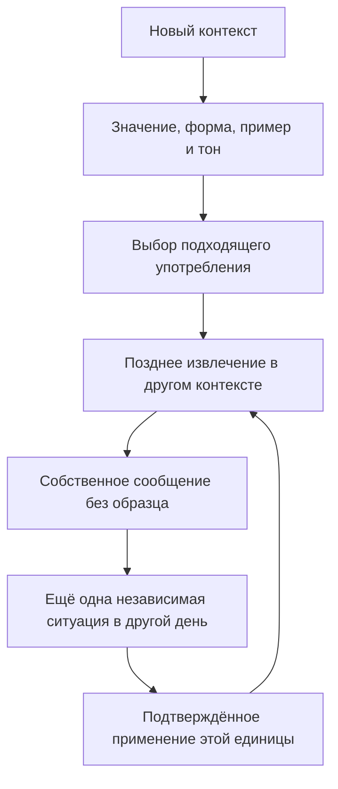

# Новая лексика для работы и жизни: исследование и требования к программе

Дата проверки источников: **4 октября 2026 года**. Исследование: **GPT-6 Astra**.
Статус: **исследовательское основание и рекомендации для реализации**.
Наличие рекомендации здесь не означает, что соответствующая функция уже доступна
в боте. Практический план: [лексическая программа](../curriculum/lexical-programme.md).
Контекст: [общая программа](../curriculum/learning-programme.md),
[рабочие потребности](workplace-business-needs.md),
[сравнение учебных программ](curriculum-benchmark-2026-10.md), [PRD §14](../../PRD.md).

## 1. Главный вывод

Нужен отдельный поток **расширения активного словаря**: новые слова в сочетаниях,
фразовые глаголы, устойчивые выражения и речевые рамки. Его целевая доля — **30%
учебной практики**. Он должен регулярно знакомить с новым материалом и возвращать
его для воспроизведения и самостоятельного применения. Пользователь уточнил
распределение: **30% общий английский + 40% рабочие ситуации + 30% новые слова
и выражения**. Это три отдельные части, вместе 100%; один ответ относится ровно
к одной части. Прежняя рекомендация 70% работы / 30% общего языка заменяется
этим распределением при применении обновлённого плана.

В лексической части могут быть и рабочие, и общие контексты; рабочая тема
лексического задания не делает его одновременно заданием из 40-процентной
рабочей части. Рабочие выражения не должны вытеснять словарь для жизни.
Пользователь указал интерес к клиентам,
бизнесу и технологическим компаниям; конкретную должность или работодателя
программа не предполагает.

Начальный рекомендуемый объём — **240 отдельных значений и конструкций**,
по 15 в 16 функциональных группах. Это размер первой редакции банка, а не
норма CEFR, не число уже известных ученику слов и не обещание усвоить их за месяц.
Приоритет — точное значение, грамматика, адресат и пригодность в собственном
ответе. Для расширения нужны стабильные идентификаторы, проверяемое происхождение
и отдельные новые ситуации; массовая генерация вариаций одного шаблона не
увеличивает реальное покрытие.

## 2. Как проводилось исследование и как читать выводы

Использованы первичные источники четырёх типов:

1. Официальная рамка Совета Европы — для языковых результатов и границ CEFR.
2. Оригинальные исследования на страницах издателей или в университетском
   репозитории — для механизмов запоминания и различия видов знания.
3. Словари Oxford/Cambridge и грамматика издателя — для значений и конструкции.
4. British Council, Cambridge и публичные материалы Google, GitLab, Atlassian —
   для учебных и рабочих ситуаций.

Для научных статей проверены доступные аннотации и библиографические данные;
полный текст использован только там, где он был открыт. Закрытые статьи не
представлены как прочитанные полностью. Поисковые блоги, подборки «100 фраз для
FAANG» и автоматически сгенерированные объяснения не использовались как
основание. Часть прямых запросов к Cambridge возвращала 403; соответствующие
значения проверялись по доступной странице издателя или Oxford. Неуспешная
загрузка сама по себе не считается проверкой источника.

Ни одно найденное исследование не проверяет именно FluentLoop, Telegram,
русскоязычного пользователя с этим расписанием или оптимальность доли 30%.
**30%, размер банка, недельный темп и пороги подтверждения ниже — проектные
решения**, а не опубликованные научные константы. Проценты отвеченных вопросов
и проценты учебного времени необходимо показывать раздельно.

## 3. Что подтверждено исследованиями

### 3.1. Учить сочетания полезно, но фразы не заменяют общую компетенцию

В эксперименте Boers и соавторов участвовали 32 студента, изучавших английский;
обучение занимало 22 часа. Группа, которой помогали замечать устойчивые сочетания
в текстах и аудио, получила более высокие оценки устной компетентности от
независимых оценщиков. Это небольшое исследование и оценка восприятия речи,
а не доказательство, что любое заучивание списка улучшает работу с клиентами.
Вывод для программы: замечать полезную форму в контексте и затем использовать
её в собственном сообщении. [Boers et al., 2006](https://journals.sagepub.com/doi/10.1191/1362168806lr195oa)

Нужны четыре вида единиц: отдельное слово вместе с типичными партнёрами
(*a constraint / work within constraints*); глагольная конструкция
(*follow up on a request*); устойчивое сочетание (*raise a concern*);
гибкая речевая рамка (*What would happen if …?*). Название «фразовые глаголы»
можно сохранить для пользователя, но внутри банка полезно различать эти типы.
Само наличие пробелов ещё не делает выражение идиомой или фразовым глаголом.

### 3.2. Считать нужно значения, а не только заголовки

PHaVE List построен на корпусном исследовании 150 частотных фразовых глаголов
и их основных значений. Авторы прямо обсуждают проблему многозначности;
выбранные значения покрывают не менее 75% употреблений каждого такого глагола
в исследованном материале. Это ориентир отбора, а не утверждение о покрытии
75% всей английской речи или современной рабочей переписки. Нужны записи
уровня «форма + конкретное значение», а не одна карточка на все значения
*take off* или *set up*. [Garnier & Schmitt, 2015](https://journals.sagepub.com/doi/abs/10.1177/1362168814559798)

Для нашего банка корпусная частотность — один фактор наряду с задачами ученика.
Полезность *push back on an assumption* в переговорах может быть высокой даже
без места в универсальном списке частотности. Нельзя называть авторский выбор
«240 самыми частотными выражениями» без собственного воспроизводимого анализа.

### 3.3. Узнавание и продуктивное знание — разные результаты

Webb сравнивал рецептивное и продуктивное изучение пар слов и измерял несколько
сторон знания. Направление обучения влияло на результат: продуктивная работа
давала преимущества по ряду продуктивных показателей, рецептивная — по
рецептивному знанию значения. Эксперимент с парами слов не равен свободной
переписке, но поддерживает необходимость раздельных показателей.
[Webb, 2009](https://journals.sagepub.com/doi/10.1177/0033688209343854)

Следовательно, верный A/B/C — свидетельство узнавания в данной ситуации.
Вставка уже показанной фразы — управляемое применение. Самостоятельный ответ
без целевой фразы и образца — более сильное, но всё ещё локальное свидетельство.
Глобальный ярлык «активно владею» нельзя получать серией одинаковых выборов.

### 3.4. Возвращение к материалу должно требовать извлечения из памяти

Karpicke и Roediger показали пользу повторного извлечения уже однажды правильно
воспроизведённых иностранных слов для отсроченного воспроизведения. В рамках
их эксперимента повторное изучение после достижения правильного ответа не
давало того же результата. Это поддерживает возвращение к уже знакомой фразе,
а не только просмотр следующей новой карточки.
[Karpicke & Roediger, 2008](https://doi.org/10.1126/science.1152408)

Однако формула «перечитывание бесполезно» слишком сильна. Soderstrom и
соавторы показали, что при контроле интервалов повторное изучение тоже помогало;
дизайн эксперимента менял взаимодействие извлечения и распределения практики.
Для бота разумны краткое объяснение, попытка вспомнить и поздний повтор,
без запрета на повторное чтение при трудности.
[Soderstrom, Kerr & Bjork, 2016](https://journals.sagepub.com/doi/10.1177/0956797615617778)

### 3.5. Интервалы важнее магической последовательности дней

В исследовании Nakata 128 японских студентов изучали 20 англо-японских пар.
Расширяющиеся интервалы имели ограниченное преимущество; сам объём разнесения
по времени влиял сильнее. Поэтому можно начинать с понятного расписания,
проверять реальное удержание и менять нагрузку. Источник не обосновывает
универсальные интервалы 1–3–7–14 дней для всех слов и учеников.
[Nakata, 2015](https://www.cambridge.org/core/journals/studies-in-second-language-acquisition/article/effects-of-expanding-and-equal-spacing-on-second-language-vocabulary-learning/D1D796306985C52F9BE7A1200AC50DB9)

В работе Nakata и Suzuki семантически близкие наборы вызывали больше ошибок
перепутывания внутри группы; распределение практики помогало отсроченному
воспроизведению. Это аргумент против первого знакомства сразу с десятью
почти взаимозаменяемыми выражениями. Функциональная группа остаётся полезной
для планирования, но новое вводится малыми порциями среди разных функций;
тонкие контрасты тренируются после первичного освоения.
[Nakata & Suzuki, 2019](https://www.cambridge.org/core/services/aop-cambridge-core/content/view/S0272263118000219)

### 3.6. Лексическая практика должна жить внутри богатой программы

Nation предлагает баланс четырёх направлений: понимание смысла во входном
материале, передача собственного смысла, внимание к языковой форме и развитие
беглости. Это педагогическая модель распределения работы, а не доказательство
точной квоты для нашего бота. Её практический смысл здесь: дополнять карточки
чтением, слушанием, письмом и общением; общий объём школьных занятий также
учитывается. [Nation, 2007, The Four Strands](https://www.victoria.ac.nz/__data/assets/pdf_file/0019/1626121/2007-Four-strands.pdf)

## 4. CEFR: что означает рост B2 → B2+ → вводный C1

В официальной шкале Vocabulary range на B2 уже есть словарь своей области,
общие темы и подходящие сочетания слов. На C1 ожидаются более широкий выбор,
гибкое переформулирование, владение распространёнными идиоматическими
выражениями и подходящей терминологией своей области. Важны также точность
выбора и социолингвистическая уместность. Рамка не устанавливает обязательное
число выученных фраз для уровня. [Council of Europe, 2020, pp. 131–138](https://rm.coe.int/common-european-framework-of-reference-for-languages-learning-teaching/16809ea0d4)

**Проектная интерпретация для этого курса:**

| Этап задачи | Что усложняется | Пример свидетельства |
| --- | --- | --- |
| B2 | Конкретная ситуация, ясная цель, правильное значение и управление | Объяснить задержку и предложить следующий шаг |
| B2+ / уверенный B2 | Новый адресат, ограничение, сочетание нескольких целей, меньше опор | Возразить по сроку, сохранив отношения и назвав реалистичную альтернативу |
| Вводный C1 | Неопределённость, конкурирующие интересы, точное смягчение и переформулирование | Пересмотреть рекомендацию при неполных данных и адаптировать формулировку для клиента |

Это этапы сложности **заданий**. Лёгкое слово может участвовать в сложной
аргументации; редкое слово не делает предложение C1. Словарную помету можно
сохранять отдельно только с указанием конкретного значения и источника.
В начальном банке `stage` — редакционное размещение в программе, а не
психометрически откалиброванная трудность или подтверждённый уровень CEFR.
Для задач вводного C1 нужны реальные ограничения по адресату, неопределённости
и конкурирующим целям; одной сложной лексемы для такой метки недостаточно.
Например, Oxford относит обсуждаемое значение *bring something up* к своей
тематической C1-разметке; это не запрещает знакомиться с ним в B2-программе
и не превращает его использование в сертификат. [Oxford: bring up](https://www.oxfordlearnersdictionaries.com/definition/english/bring-up)

В FluentLoop существующий порог по десяти адаптивным темам для открытия C1
должен сохраниться. Лексические результаты дополняют его и не подменяют.
Текстовый ответ не измеряет произношение, скорость реакции, понимание речи
или умение вести встречу в реальном времени.

## 5. Разбор главного примера: push back on

Oxford выделяет два разных употребления: *push back (on something)* —
сопротивляться идее или изменению, с пометой преимущественно североамериканского
употребления; *push something back* — перенести событие на более позднее время.
Их необходимо хранить отдельными значениями. [Oxford: push back](https://www.oxfordlearnersdictionaries.com/definition/english/push-back)

Все примеры ниже авторские, созданные для программы.

| Конструкция | Значение и собственный пример | Что требуется от ученика |
| --- | --- | --- |
| `push back on + issue/proposal/assumption` | Возразить: *I'd like to push back on the assumption that all customers need this feature.* | Назвать, с чем не согласен, и привести основание |
| `push + event/date + back` / `push back + event/date` | Перенести позже: *We need to push the review back to Thursday.* | Указать новую дату, чтобы не оставлять двусмысленности |
| `push it back` | То же значение с местоимением: *Could we push it back by two days?* | Поставить местоимение перед частицей |
| `pushback` | Существительное: *The proposal met with pushback from the support team.* | Отличать название реакции от глагольного действия |

Существительное Cambridge описывает как отрицательную реакцию на изменение
или новое предложение. [Cambridge: pushback](https://dictionary.cambridge.org/us/dictionary/english/pushback)
Правило позиции местоимения относится к разделяемой конструкции, а не ко всем
глаголам с предлогом. [Cambridge: multi-word verbs](https://dictionary.cambridge.org/grammar/british-grammar/phrasal-verbs-and-multi-word-verbs)

**Прагматическая рекомендация автора:** фраза *I want to push back* обозначает
сопротивление и может звучать прямо. В отношениях с новым клиентом полезно иметь
выбор: *I have a concern about the proposed timing. Could we consider a smaller
first release?* Это не универсальная шкала вежливости: тон, полномочия и история
отношений меняют эффект. Следует учить действию «возразить с причиной и вариантом»,
а не требовать одну престижную формулу во всех письмах.

Задание на перенос: после обсуждения сроков дать ситуацию об исключении
проверки качества. Ученик должен выразить несогласие и альтернативу без
показанного оборота. Новый срок и фамилия в прежнем шаблоне — слишком слабый
перенос. Нельзя считать точное совпадение со словарной строкой достаточной
проверкой смысла и тона.

## 6. Дополнительные контрасты для редактора банка

| Пара или рамка | Проверенный смысл и учебная ловушка | Источник |
| --- | --- | --- |
| `bring an issue up` / `an issue comes up` | В первом случае человек поднимает тему; во втором тема возникает в разговоре. Отличается структура действия. | [Oxford: bring up](https://www.oxfordlearnersdictionaries.com/definition/english/bring-up), [come up](https://www.oxfordlearnersdictionaries.com/definition/english/come-up) |
| `follow up on a request` / `follow through on a commitment` | Последующее действие по вопросу и доведение обязательства до выполнения — разные акценты; контекст должен исключать оба одновременно верных варианта. | [Oxford: follow up](https://www.oxfordlearnersdictionaries.com/definition/english/follow-up_1), [Cambridge: follow through](https://dictionary.cambridge.org/dictionary/english/follow-through?q=follow-through_1) |
| `look into a problem` | Исследовать вопрос; местоимение остаётся после `into`: авторский пример *I'll look into it today.* | [Oxford: look into](https://www.oxfordlearnersdictionaries.com/definition/english/look-into) |
| `sign off on a proposal` | Одобрить окончательно; Oxford отмечает североамериканское неформальное употребление. Формальность решения не означает формальный регистр выражения. | [Oxford: sign off on](https://www.oxfordlearnersdictionaries.com/definition/english/sign-off-on) |
| `roll out a service` | Запустить или сделать доступным новый продукт/услугу; в авторском примере *We will roll it out to two teams first.* Отдельно указывается объект и аудитория запуска. | [Oxford: roll out](https://www.oxfordlearnersdictionaries.com/definition/english/roll-out_1) |
| `put off a meeting` / `put someone off` | Перенос события и воздействие на желание человека — разные значения; для первого нужен свой sense ID. | [Oxford: put off](https://www.oxfordlearnersdictionaries.com/definition/english/put-off) |

Cambridge различает фразовые, предложные и фразово-предложные глаголы и
подчёркивает, что фразовые глаголы часто, но не всегда менее формальны, чем
однословный эквивалент. Поэтому поля «управление», «разделяемость» и «регистр»
следует заполнять для конкретного значения; автоматические правила
«все phrasal verbs неформальны» или «местоимение всегда в середине» неверны.
[Cambridge Grammar](https://dictionary.cambridge.org/grammar/british-grammar/phrasal-verbs-and-multi-word-verbs)

## 7. Чему учат издатели и реальные рабочие материалы

Cambridge *Business Vocabulary in Use Advanced* содержит 66 тематических
и функциональных разделов и опирается на деловой корпус для сочетаний.
Для FluentLoop полезна широта функций и связь формы с употреблением;
переносить главы или упражнения книги в банк не требуется.
[Cambridge: введение издателя](https://assets.cambridge.org/97813166/28225/frontmatter/9781316628225_frontmatter.pdf)

У British Council материал B2 *Challenging someone's ideas* показывает
согласие с частью позиции, уточнение осуществимости и возражение. Это хороший
пример функционального обучения с аудиовизуальным контекстом. Наличие такой
функции уже на B2 подтверждает, что несогласие не нужно откладывать до C1.
[British Council: Challenging someone's ideas](https://learnenglish.britishcouncil.org/free-resources/speaking/b2/challenging-someones-ideas)

Материал C1 *A project management meeting* использует несколько участников,
загрузку и распределение ответственности. Его можно применять как внешнее
аудирование с последующим собственным итогом; сложность встречи шире знания
отдельных терминов. [British Council: A project management meeting](https://learnenglish.britishcouncil.org/free-resources/listening/c1/project-management-meeting)

Google в руководстве для международной аудитории рекомендует избегать
культурно зависимых оборотов, сленга и идиом в документации. Это существенная
поправка к идее «больше идиом = лучше деловой английский»: полезно понимать
их у собеседника и выбирать прозрачный эквивалент в своём документе.
[Google: Write for a global audience](https://developers.google.com/style/translation)

GitLab описывает письменную и асинхронную коммуникацию; для программы отсюда
следуют задачи с достаточным контекстом, ясным запросом и фиксацией результата.
Корпоративный handbook описывает одну организацию, а не общий стандарт всех
технологических компаний. [GitLab: Communication](https://handbook.gitlab.com/handbook/communication/)

Atlassian предлагает обсуждать ограничения проекта и допустимые компромиссы.
Это источник ситуаций выбора между сроком, объёмом и качеством, где сочетания
нужно применять к данным. [Atlassian: Trade-offs](https://www.atlassian.com/team-playbook/plays/trade-offs)

Google SRE рассматривает разбор инцидентов без персональных обвинений и действия
после происшествия. Для лексики нужны отдельные ситуации про факты, влияние,
снижение последствий и следующий шаг; нельзя превращать разбор в поиск виновного.
[Google SRE: Postmortem culture](https://sre.google/sre-book/postmortem-culture/)

## 8. Карта покрытия: 16 функций

Следующая таблица — **авторская рекомендация**. Примеры показывают направление
отбора; каждый окончательный элемент проверяется отдельно. Таблица не утверждает,
что все выражения уже находятся в машинном банке или имеют одинаковый уровень.
По 15 единиц на группу — управляемая стартовая редакция; 180 рабочих и 60 общих
единиц не определяют распределение занятий 30/40/30.

| ID | Функция | Примеры кандидатов | Результат применения |
| --- | --- | --- | --- |
| `discovery` | Выяснить потребность клиента | clarify a requirement; pain point; get to the bottom of | Три уточнения, связывающие проблему с желаемым результатом |
| `clarification` | Проверить понимание | spell out; walk someone through; in other words | Пересказ запроса и один точный уточняющий вопрос |
| `updates` | Дать статус и вернуться к вопросу | follow up on; keep someone posted; on track | Что сделано, что мешает, когда следующее обновление |
| `disagreement` | Возразить и обозначить границу | push back on; raise a concern; challenge an assumption | Причина несогласия, риск и реалистичная альтернатива |
| `negotiation` | Договориться об объёме и условиях | meet halfway; subject to; narrow down | Условное предложение без обещания неподтверждённого |
| `priorities` | Расставить приоритеты | trade-off; set aside; take precedence | Выбор с явным объяснением того, чем жертвуем |
| `decisions` | Сравнить варианты и получить решение | weigh up; rule out; sign off on | Рекомендация, ограничение и запрос на одобрение |
| `ownership` | Передать задачу и ответственность | hand over; take ownership; follow through | Кто отвечает, что передаётся и что считается готовым |
| `incidents` | Сообщить о риске и восстановлении | look into; contingency; mitigate a risk | Факт, влияние, неизвестное, действие, время обновления |
| `evidence` | Объяснить данные и неопределённость | account for; caveat; preliminary findings | Вывод с оговоркой без выдуманной причинности |
| `feedback` | Дать обратную связь и сотрудничать | build on; take feedback on board; constructive | Наблюдение, эффект и конкретная просьба |
| `technical_explanation` | Объяснить изменение и зависимость | roll out; phase out; dependency | Одно изменение для специалиста и для клиента |
| `personal_plans` | Планировать жизнь и обучение | put off; fit in; stick to | Реалистичный план и его изменение при ограничении |
| `relationships` | Общаться и понимать людей | catch up with; get along with; considerate | Договориться о встрече или уважительно обсудить разницу |
| `everyday_problems` | Решать бытовую проблему | sort out; run out of; come up | Объяснить проблему, попросить помощь и согласовать шаг |
| `opinions_learning` | Рассуждать, читать и учиться | take into account; make sense; change one's mind | Сопоставить позиции и объяснить пересмотр своего мнения |

Функция и контекст различаются: *put off* полезно и в работе, и в быту. Для
одной единицы можно создать оба контекста, но её первое знакомство не нужно
считать дважды. Сопоставление с существующими модулями плана должно быть явным;
пауза модуля должна действовать и на связанные новые задания.

## 9. Какие 30% и сколько нового

Для условных 100 отвеченных заданий при достаточном доступном материале:

| Часть программы | Заданий | Что учитывается |
| --- | ---: | --- |
| Общий английский | 30 | Личные, общественные и учебные ситуации общей программы |
| Рабочие ситуации | 40 | Клиенты, бизнес, технологии и поддерживающие языковые задачи |
| Новые слова и выражения | 30 | Знакомство с лексикой, её извлечение и закрепление |
| **Всего** | **100** | **Каждый ответ учитывается один раз** |

Это три целевые доли, а не требование точного результата
каждых десяти вопросов. В короткой сессии, при паузах, уровне или отсутствии
доступного повтора доли отклоняются; это нужно показывать честно. Нельзя
нарушать интервалы или открывать закрытый уровень ради красивого процента.

Лексическая доля состоит из **знакомства с новым, извлечения знакомого и
применения**. Если все её 30% всегда заняты невиданными единицами, обязательства
по повторению быстро растут. Если весь приоритет безусловно получают просроченные
карточки, новое может исчезнуть. Нужен отдельный учёт впервые изученных значений
и способ защищать регулярное пополнение, пока подходящий новый материал доступен.

Рекомендуемый старт для 150 минут в неделю: **6–10 новых значений**, для
90 минут — **3–5**. Это гибкие ориентиры первого двухнедельного пилота.
Внутри 45 лексических минут при режиме 150 минут можно отвести примерно
15 минут на знакомство, 20 на извлечение и 10 на самостоятельное применение.
При явной перегрузке уменьшается вход нового, а не отменяется повторение.
Конкретные автоматические лимиты требуют отдельной реализации; эти числа не
должны появляться в интерфейсе как уже действующий алгоритм без проверки.

При 6–10 новых значениях в неделю первичное знакомство с банком 240 единиц
занимает арифметически 24–40 недель. Знакомство не равно освоению; ранее известные
единицы, пропуски, приоритеты и трудности меняют срок. Банк можно расширять до
480 и далее по обнаруженным потребностям, а не по календарному обещанию.

## 10. Цикл одной единицы и подтверждение результата

Рекомендуется различать состояния: «познакомился», «узнал в контексте»,
«воспроизвёл с опорой», «применил самостоятельно», «повторно применил позже».
Первый показ считается знакомством, даже если ученик сразу угадал ответ.
Просмотр объяснения и копирование образца не дают независимого результата.

**Принятое ограничение первой реализации (ADR-0017).** Письменное задание
называет целевое выражение, но не подсказывает определение и готовый ответ.
Ученик самостоятельно составляет сообщение для новой ситуации; позднее
получает другой контекст. Это **самостоятельно составленное применение с
заданным выражением** (*guided application*). Независимость относится к
авторству ответа и условиям проверки, а не к извлечению формы без подсказки.
Такое свидетельство сильнее выбора варианта, но не подтверждает спонтанное
употребление, свободное припоминание или общую беглость. Проверка без названной
фразы остаётся отдельным будущим этапом; её нельзя приписывать текущей вехе.

Для положительной письменной проверки важны: соответствие ситуации, правильное
значение, допустимая грамматика, понятное сообщение и подходящий тон. Ошибка
в статье не должна автоматически приравниваться к неверному значению;
оценка должна объяснять, какая цель выполнена. Если ученик успешно решает
ситуацию без целевой фразы, можно признать коммуникативный успех, но не
приписывать продуктивное владение именно этой единицей.

Два разных письменных контекста в разные локальные дни с интервалом не менее
24 часов — разумное **локальное правило доказательств**, совместимое с текущей
архитектурой. Оно не является научно установленной границей долговременного
владения. Недоступная проверка, stub/fallback, переписанный моделью текст,
самоотчёт и повторный ответ не создают подтверждения. Для устной компетенции
нужна внешняя устная практика; бот должен обозначать её как самоотчёт.

## 11. Контракт качественного и расширяемого банка

Это требования к содержанию; точные имена полей и хранение фиксируются ADR
и реализацией. Рекомендуемый формат совместим с существующими версиями JSON
в `src/fluentloop/seeds/`; содержимое и история пользователя разделены.

| Данные | Требование |
| --- | --- |
| Стабильный ID и версия | ID означает одно значение/конструкцию; правка опечатки не создаёт новую единицу |
| Форма и тип | Слово с сочетанием, phrasal/prepositional verb, collocation или flexible frame |
| Значение RU и EN | Короткие авторские определения одного и того же смысла |
| Грамматическая рамка | Объект, предлог, разделяемость, допустимое дополнение; неверный вариант объясняется |
| Пример | Авторское естественное предложение, содержащее целевую форму или явно допустимое изменение |
| Регистр | Нейтральное/разговорное/формальное, региональная помета, тип аудитории; без выдуманной универсальной вежливости |
| Прозрачная альтернатива | Подходящий однословный или прямой способ сообщить тот же смысл, где полезно |
| Функция и контекст | Из карты покрытия; явные ссылки на допустимые модули плана |
| Сложность | Этап задания отдельно от подтверждённой словарной CEFR-пометы |
| Два вопроса на узнавание | Самодостаточные ситуации, один действительно лучший ответ, осмысленные отвлекающие варианты |
| Два письменных задания | Разные коммуникативные условия; не косметическая замена имени или даты |
| Источник и проверка | Прямая ссылка на словарное значение или первичное употребление; дата, граница проверенного и авторского |

**Правило происхождения.** Ссылка на словарь подтверждает только то, что
действительно есть в статье. Для авторского сочетания из известного слова
нужно указать «значение слова проверено; рамка и пример авторские», если
самого сочетания в источнике нет. Нельзя добавлять 240 правдоподобных URL
и сообщать, что 240 записей независимо проверены. Недоступные источники
требуют другого первичного подтверждения или честного статуса проверки.

**Правило авторства.** Определения, примеры, дистракторы и ситуации создаются
заново; учебники и словари используются как справочники, а не как банк для
массового копирования. Стабильная гиперссылка на источник полезнее длинной
выписки, которая не нужна ученику.

**Редакторская проверка.** Нужны точность значения, естественность сочетания,
конструкция, тон, один ключ, отсутствие подсказки в длине ответа и достаточные
факты в условии. Неверный ответ должен быть неверным из-за проверяемой цели;
другую столь же естественную перефразировку нельзя объявлять ошибкой. Особенно
опасны тройки *raise / bring up / flag a concern*, если контекст допускает всё.

**Проверка расширения.** Новая пачка не должна менять смысл старых ID, стирать
прогресс или пересоздавать текущий вопрос. Нужно проверять дубликаты формы+смысла,
разнообразие функций и жанров, доступность общей части, происхождение и
различие двух письменных контекстов. Отдельная корректная запись не доказывает,
что вся коллекция прошла независимую лингвистическую редактуру.

## 12. Требования к интеграции и границы

1. Три редактируемые части: общий английский, работа и лексика; их сумма 100%.
   Сохранённый план не подменяется новой рекомендацией без действия пользователя.
2. Реальный выбор заданий учитывает все три доли, приоритеты, паузы, уровень,
   очередь повторов и недавние показы. Пустой пул имеет понятный fallback.
3. «Новая единица» означает первый контакт с данным значением, а «новый вопрос»
   может быть лишь вариантом старой единицы. Счётчики различаются.
4. Повторное открытие незавершённого вопроса не считается новым показом или
   новым словом. Правки плана относятся к следующему выбору.
5. Узнавание и собственное письмо имеют разные доказательства. Лексическая
   практика не ускоряет незаметно существующую сертификацию модулей и тем.
6. Новые упражнения по одобренному содержимому допустимы; новые концепции из
   личной загрузки сохраняют предусмотренное PRD подтверждение.
7. Simple mode остаётся ручным. Лексическая доля сама по себе не включает
   рассылки, не меняет профили других пользователей и не запускает автоимпорт.
8. Расширение программы не должно раскрывать held-out задания адаптивного
   переноса, приватные заметки или реальные рабочие сообщения.

## 13. Как оценивать пилот через две–четыре недели

Сначала проверить работу отбора: доступны ли новые значения, соблюдаются ли
паузы, не пропадает ли общая часть, не выдаётся ли тот же контекст слишком рано.
Затем смотреть учебный результат: сколько единиц впервые изучено, сколько
правильно узнано позже, сколько самостоятельно использовано, сколько снова
потребовало объяснения. Сессионная точность полезна, но недостаточна.

Отдельно спросить, какие функции понадобились на деле и где мешал тон или
предлог. Пользователь может сообщить об употреблении на встрече, но это
самоотчёт, а не автоматически проверенная устная компетенция. На этой основе
меняются приоритеты и скорость ввода, а не переписывается история результатов.

Признаки проблемы: всегда верные ответы при отсутствии свободного употребления;
правильное слово с неверным управлением; фраза, подходящая коллеге, но резкая
для клиента; несколько дней без нового при непустом банке; рост просроченного
повтора; рост счётчика «выучено» после перечитывания. Это конкретные сигналы для
изменения заданий и темпа, а не повод обещать ускоренный C1.

## 14. Решения для первой версии

Рекомендуется начать с 240 единиц и 16 функций, создать разнообразные
контекстные вопросы и самостоятельные письменные ситуации, подключить
30-процентную долю к существующему Study и сделать её видимой в плане и итоге.
На первом этапе достаточно локальных прозрачных доказательств без новой
модели глобального уровня. Частотность и уровни, которых мы не измеряли,
не публикуются как факты.

Следующее расширение определяется провалами покрытия: например, слишком
мало выражений для переговоров о ресурсах или для повседневных отношений.
Улучшение качества дистракторов, обратной связи и самостоятельных контекстов
может дать больше пользы, чем немедленное увеличение банка до тысячи строк.
Большой банк должен быть содержательно широким и проверяемым.

## 15. Выборочная проверка начального банка, 4 октября 2026

После появления JSON проверены 32 записи: по две из каждой функции. Проверка
охватила смысл, конструкцию, регистр, оба ключа узнавания и письменные условия.
Смысл сопоставлялся с первичными словарями; для `scope creep` использовано
определение PMI. Это выборочный аудит, **не независимая проверка всех 240
записей** и не измерение эффективности заданий на учениках.

| Функция | Проверенная пара |
| --- | --- |
| Выявление потребности | requirement; constraint |
| Уточнение | ambiguous; spell out |
| Статус и изменения | roll out; push something back |
| Несогласие | push back on; with all due respect |
| Переговоры | trade-off; meet halfway |
| Приоритеты | scope creep; take precedence |
| Решения | sign off on; weigh up |
| Ответственность | accountable; follow through on |
| Инциденты | mitigate; workaround |
| Доказательства | account for; bear out |
| Обратная связь | take on board; build on |
| Техническое объяснение | walk through; redundant |
| Личные планы | fit in; put off |
| Отношения | get along with; let someone down |
| Бытовые проблемы | run out of; break down |
| Мнения и обучение | take something into account; make sense |

В этой выборке не обнаружено ошибочного ключа или неверного основного значения.
Дистракторы часто слишком очевидны: буквальное толкование или заведомо
нереалистичное утверждение легко исключить. Правильный ответ в таких вопросах
нельзя считать сильным доказательством глубины знания.

Обнаружены и переданы автору точные исправления происхождения: оценивание
вариантов находится в [Oxford: weigh](https://www.oxfordlearnersdictionaries.com/definition/english/weigh),
дружеские отношения `get along with` — в статье [get on](https://www.oxfordlearnersdictionaries.com/definition/english/get-on).
Дополнительно проверено, что разрешение начать действие — существительное
[go-ahead](https://www.oxfordlearnersdictionaries.com/definition/english/go-ahead_3),
а не одноимённое прилагательное. Для идиом доступны точные страницы
[meet someone halfway](https://dictionary.cambridge.org/us/dictionary/english/meet-halfway),
[take something into account](https://dictionary.cambridge.org/dictionary/english/take-into-account)
и [make sense](https://www.merriam-webster.com/dictionary/make%20sense).

Для `with all due respect` словарь подчёркивает формальное, нередко сильное
несогласие; фраза не гарантирует мягкости. Это поддерживает предупреждение
о тоне на карточке. [Oxford: respect, idioms](https://www.oxfordlearnersdictionaries.com/definition/english/respect_1)

По результатам аудита из письменных условий убрана подсказка определения;
целевое выражение остаётся заданным, как описано в §10. Повторная проверка
`mitigate` и `redundant` подтвердила добавленные условия: конкретный адресат,
оставшийся риск, ограничения решения или компромисс стоимости. Это улучшает
задачи, но не превращает редакционные метки в откалиброванный CEFR-тест.
