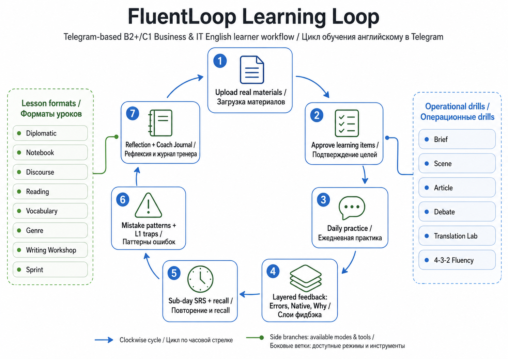
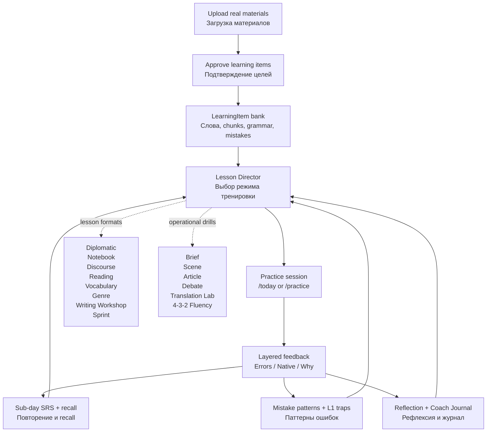

# FluentLoop User Guide / Руководство пользователя

FluentLoop is a Telegram learning loop for B2+/C1- business and IT English.
It is designed for short daily practice over your real materials, not for
random generic exercises.

FluentLoop - это Telegram-бот для английского B2+/C1- с фокусом на business
and IT English. Главная идея: тренироваться каждый день на своих реальных
материалах, получать точный фидбэк, возвращать слабые места в повторение и
постепенно превращать пассивный английский в активный.

---

## 1. Методология / Methodology

FluentLoop построен как повторяемая петля:

```text
approved input -> daily retrieval -> layered feedback -> SRS ->
mistakes/L1 traps -> reflection -> teacher/curriculum loops
```

По-русски:

1. **Approved input.** Ты загружаешь реальные материалы: lesson notes,
   рабочие фразы, статью, homework, teacher feedback. Бот извлекает цели, но
   новые активные элементы появляются только после approval.
2. **Daily retrieval.** Каждый день `/today` дает короткую 15-minute сессию:
   recall, cloze, rewrite, translation, free production, cold recall.
3. **Layered feedback.** Ответ проверяется не одним серым verdict, а слоями:
   `Errors` - что неверно, `Native` - как сказал бы носитель, `Why` - почему
   это важно.
4. **Sub-day SRS.** Правильные и слабые элементы возвращаются через интервалы
   от секунд/минут до дней, чтобы закрепить не только узнавание, но и
   продуктивный recall.
5. **Mistakes + L1 traps.** Повторяющиеся ошибки и Russian L1 interference
   становятся отдельными training targets.
6. **Reflection + teacher loop.** `/reflect` и `/mentor` помогают увидеть,
   где ты упрощаешь мысль из-за нехватки языка, а Lesson Director выбирает
   следующий режим тренировки.

The English version:

1. **Approve real input.** Upload your real learning/work material and approve
   the targets you want to train.
2. **Retrieve daily.** `/today` gives you a short staged session with active
   recall and realistic production.
3. **Read layered feedback.** Use Errors, Native, and Why as separate channels.
4. **Let SRS recycle targets.** Good, Hard, Again, confidence, and skips affect
   what returns later.
5. **Train mistake patterns.** Repeated mistakes and Russian L1 traps become
   focused drills.
6. **Reflect and steer.** Use `/reflect`, `/mentor`, and focused practice modes
   to turn the loop into a personal training plan.

---

## 2. Карта процесса / Process Map



The PNG above is the polished learner-facing map. The Mermaid source below is
kept as the editable version of the same process.



### GPT Image prompt

Use this prompt if you want a polished visual map:

```text
Create a clean bilingual RU/EN process map for "FluentLoop Learning Loop", a Telegram-based English learning bot for B2+/C1 business and IT English.

Style: modern product education diagram, white background, dark text, subtle blue/green accents, clear arrows, no clutter, no mascots.

Show 7 connected stages in a loop:
1. Upload real materials / Загрузка материалов
2. Approve learning items / Подтверждение целей
3. Daily practice / Ежедневная практика
4. Layered feedback: Errors, Native, Why / Слои фидбэка
5. Sub-day SRS + recall / Повторение и recall
6. Mistake patterns + L1 traps / Паттерны ошибок
7. Reflection + Coach Journal / Рефлексия и журнал тренера

Add side branches for:
- Lesson formats: Diplomatic, Notebook, Discourse, Reading, Vocabulary, Genre, Writing Workshop, Sprint
- Operational drills: Brief, Scene, Article, Debate, Translation Lab, 4-3-2 Fluency

Make it feel like a practical learner guide, not a marketing poster. Use simple icons: document, checklist, chat bubble, layered cards, clock, warning marker, notebook.
```

---

## 3. Daily Use / Ежедневное использование

### Standard daily loop

1. Send `/today`.
2. Read the current step and answer in text.
3. Before answering, optionally tap confidence `1-5`.
4. If stuck, use Skip / show answer or `/skip`.
5. Read the compact feedback.
6. Use the feedback buttons:
   `Errors` for accuracy, `Native` for natural phrasing, `Why` for the rule and
   transfer logic.
7. At the end, save one line with `/reflect <what was hardest today?>`.

### How to read feedback

- **Correct** means the answer works for the exercise.
- **Partial** often means the meaning is clear, but grammar, register, or L1
  transfer needs repair.
- **Again** means the target should come back soon.
- **Native rewrite** is not always "the only correct answer"; it is a stronger
  workplace version to imitate.
- **L1 trap** flags a likely Russian-to-English transfer issue, such as a wrong
  preposition, missing article, or too-direct workplace tone.

---

## 4. Adding Material / Добавление материалов

Use this when you want FluentLoop to learn from your real lessons or work.

1. Send `/upload`.
2. Choose the material type if the bot asks.
3. Paste lesson notes, homework, article text, useful phrases, or teacher
   feedback.
4. Review extracted candidates with `/candidates <material_id>`.
5. Approve useful targets with `/approve <material_id>` or candidate buttons.
6. Start practice with `/today`, `/lesson random`, or a focused `/practice`
   mode.

Important: uploaded material does not automatically become active training
content. Approval is the quality gate.

---

## 5. Practice Modes / Режимы практики

Use `/today` when you want the bot to choose. Use `/practice <mode>` when you
know what you want to train.

| Command | Use when... |
|---|---|
| `/practice vocab` | You want active chunks, collocations, field/register/function grouping. |
| `/practice grammar` | You want grammar repair and sentence transformation. |
| `/practice mistakes` | You want recurring mistakes and confirmed weak points. |
| `/practice diplomatic` | Your message is correct but too blunt for C1 workplace English. |
| `/practice notebook` | You want free writing plus native-diff mining. |
| `/practice discourse` | You want paragraph logic: claim, support, counterpoint, recommendation. |
| `/practice reading` | You want critical reading: claim, hedge, assumption, summary. |
| `/practice genre` | You want a work artifact schema: RFC, post-mortem, review, proposal, etc. |
| `/practice writing_workshop` | You want outline -> draft -> revision. |
| `/practice sprint` | You want a 14-day consistency contract. |

Operational drills are just-in-time tools:

| Command | Use when... |
|---|---|
| `/brief <agenda>` | You need meeting language before a call. |
| `/scene <topic or number>` | You want a roleplay scene card. |
| `/article <text>` | You want a 5-module Article Lab plus 30-day pipeline. |
| `/debate <topic>` | You want to defend a position against opposition. |
| `/translate_lab <topic>` | You want RU-to-EN transfer practice and L1 trap repair. |
| `/fluency432 <topic>` | You want to compress the same message in 4, 3, then 2 minutes. |

---

## 6. First Week Onboarding / Первая неделя

**Day 1 - material.**
Upload one real source with `/upload`, review candidates, approve only useful
targets.

**Day 2 - baseline.**
Run `/today`, answer honestly, use confidence ratings, and do not over-polish.

**Day 3 - free writing.**
Run `/practice notebook`. Write about a real technical conversation. Read the
native rewrite and mined chunks.

**Day 4 - operational English.**
Use `/brief <your next meeting>` or `/scene 2` before a real work situation.

**Day 5 - reflection.**
Run `/today`, then send `/reflect <what was hardest?>` and `/mentor`.

**Weekend - review.**
Use `/review`, `/mistakes`, and `/stats`. Pick one mode for the next week:
`diplomatic`, `vocab`, `genre`, or `sprint`.

---

## 7. Practical Rules / Практические правила

- Train from real material more often than from invented examples.
- Approve fewer, better targets. Bad input creates bad practice.
- Answer before looking at the model answer when possible.
- Treat native rewrites as imitation material, not as criticism.
- Use `/reflect` when the problem is not grammar but "I could not express what
  I actually meant."
- Use `/practice sprint` only when you are ready to keep a 14-day streak.

The bot is most useful when you let it see the loop: what you tried, what failed,
what came back, and what still feels hard.
