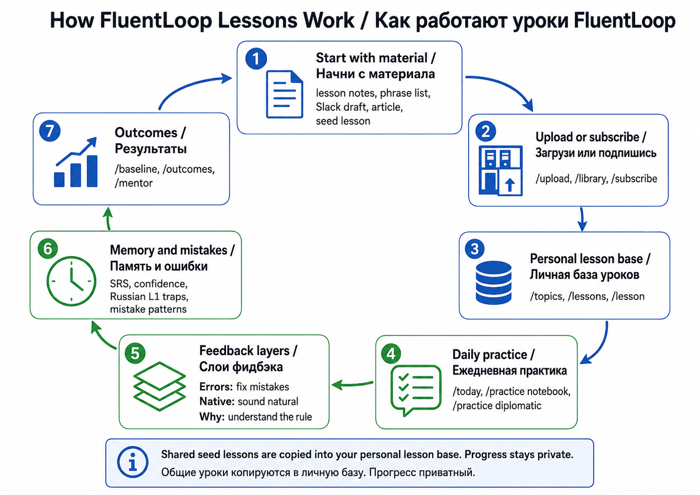
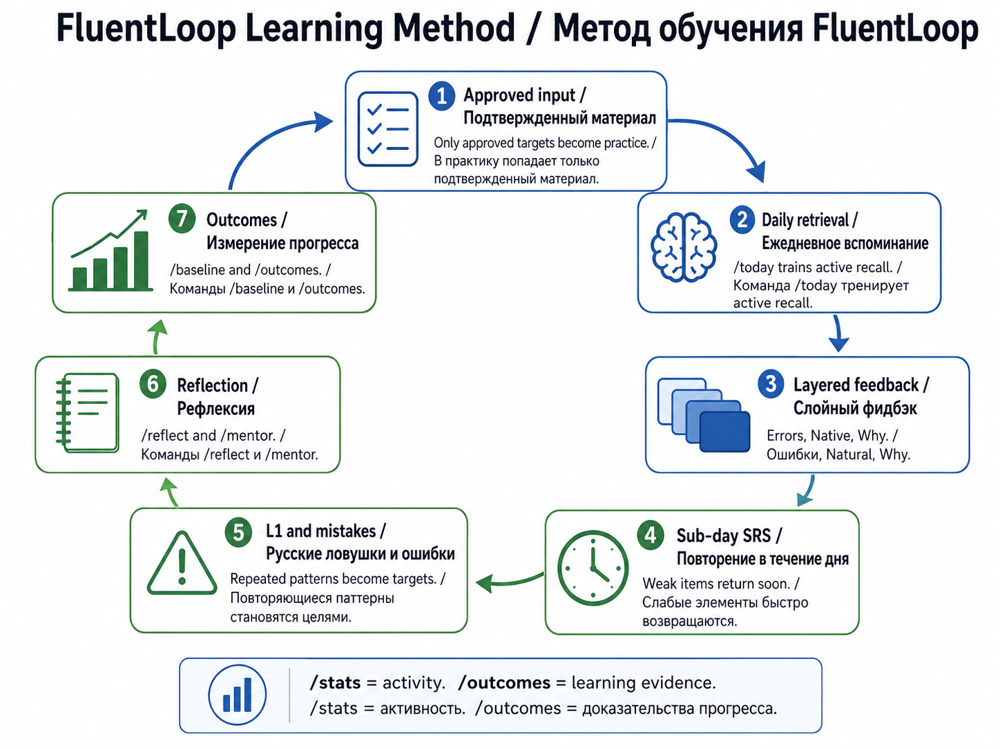
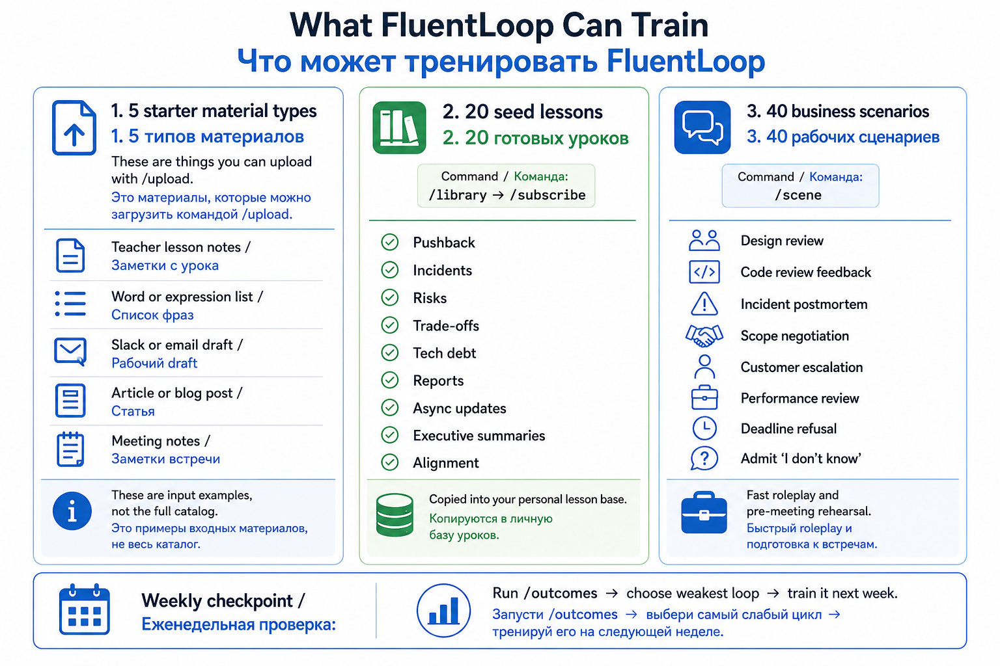
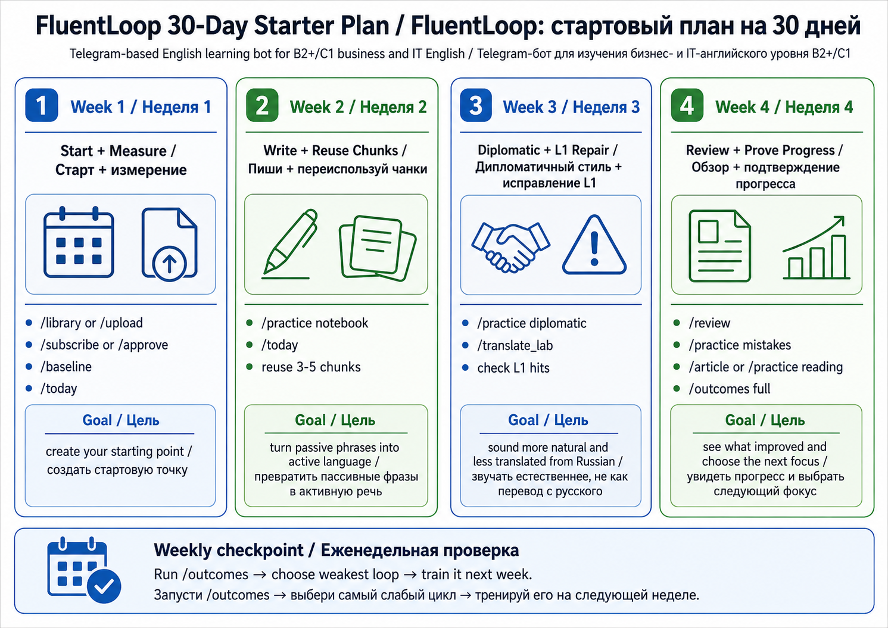

# FluentLoop User Guide / Руководство пользователя

FluentLoop - это Telegram-бот для английского B2+/C1- в business/IT контексте.
Он помогает не просто "решать упражнения", а превращать реальные материалы,
ошибки и рабочие ситуации в измеримый цикл обучения.

Коротко: этот guide отвечает "как пользоваться". Методологию отдельно смотри в
[learning-methodology.md](learning-methodology.md), а текущие публичные уроки и
типы уроков - в [lesson-catalog/index.md](lesson-catalog/index.md).

## 1. FluentLoop за 2 минуты

Что умеет система:

- **Учится на твоих материалах.** Можно загрузить lesson notes, список фраз,
  Slack/email draft, статью, meeting notes или homework через `/upload`.
- **Дает готовую базу уроков.** Можно открыть `/library`, выбрать seed lesson и
  скопировать его в личную базу через `/subscribe <template_id>`.
- **Тренирует каждый день.** `/today` собирает короткую сессию из твоей личной
  базы: recall, cloze, rewrite, translation, free production, cold recall.
- **Проверяет ответ слоями.** `Errors` чинит ошибки, `Native` показывает, как
  звучит естественнее, `Why` объясняет правило и transfer logic.
- **Возвращает слабые места.** SRS, confidence, L1 traps и mistake patterns
  решают, что должно вернуться позже.
- **Мерит прогресс.** `/baseline` создает стартовую точку, `/outcomes` показывает
  30-day evidence: retention, chunks, L1 density, writing metrics, mistakes.

Главный принцип: FluentLoop полезен, когда видит полный loop:

```text
real material -> approved targets -> daily practice -> feedback ->
SRS/mistakes -> reflection -> outcomes -> next focus
```



## 2. Что система делает на простых материалах

### Пример 1: список фраз с урока

Input:

```text
Lesson: Stakeholder pushback
Chunks:
- push back on
- align on priorities
- it might be worth considering
Mistake: I said "depend from"; correct is "depend on".
Example: We need to align on the scope before Friday.
```

Что сделает FluentLoop:

- извлечет chunks и mistake risk;
- попросит approve перед добавлением в практику;
- даст cloze/rewrite/recall в `/today`;
- поймает L1 trap вроде `depend from`;
- покажет в `/outcomes`, используешь ли ты chunks активно.

Следующие команды: `/upload` -> `/approve <material_id>` -> `/today`.

### Пример 2: Slack/email draft

Input:

```text
Context: I need to tell a product manager that the deadline is risky.
My draft:
Your plan is unrealistic. We will break production.

Better goal:
Sound firm but not aggressive.
```

Что сделает FluentLoop:

- превратит слишком прямой draft в diplomatic rewrite target;
- предложит softer variants через `Native`;
- объяснит pragmatics в `Why`;
- отправит тебя в `/practice diplomatic` или `/translate_lab`.

Следующие команды: `/upload` или сразу `/practice diplomatic`.

### Пример 3: seed lesson из `/library`

Input:

```text
/library risk
/subscribe 12
```

Что сделает FluentLoop:

- скопирует shared seed lesson в твою личную базу;
- прогресс останется твоим, template rows не используются для practice;
- урок появится в `/lessons`, `/lesson <id>`, `/topics`;
- `/today` сможет брать цели из этого урока.

Следующие команды: `/library` -> `/subscribe <template_id>` -> `/lessons`.

### Пример 4: статья или blog post

Input:

```text
/article Platform teams often fail when ownership is unclear...
```

Что сделает FluentLoop:

- даст Article Lab v1: claim, hedge marker, assumption challenge, summary;
- запишет lightweight reading probe без сохранения текста статьи;
- учтет reading event в `/outcomes`;
- поможет тренировать executive summary и critical reading.

Следующие команды: `/article <text>` или `/practice reading`.

## 3. Методика обучения



### 1. Approved input

Новые learning items не становятся активными автоматически. Ты загружаешь
материал, бот извлекает candidates, а ты подтверждаешь полезное через
`/approve`. Это защищает практику от мусора.

### 2. Daily retrieval

Каждый день `/today` заставляет доставать язык из памяти. Это важнее, чем
просто читать списки слов. Хороший ответ, skip, confidence и ошибки влияют на
то, что вернется дальше.

### 3. Layered feedback

После ответа смотри не только verdict:

- `Errors` - что неверно или рискованно.
- `Native` - как звучит естественнее в рабочем английском.
- `Why` - какое правило, register или L1-transfer стоит понять.

### 4. Sub-day SRS

Некоторые цели возвращаются в той же сессии или позже в течение дня. Это нужно
для productive recall: не "узнал фразу", а смог использовать ее снова.

### 5. Mistake/L1 loop

Повторяющиеся ошибки и русские transfer patterns становятся отдельными targets.
Примеры: wrong preposition, missing article, too-direct workplace tone,
literal translation.

### 6. Reflection + Coach Journal

`/reflect <text>` сохраняет короткую заметку: что было трудно, где не хватило
языка, что попробовать завтра. `/mentor` пишет Coach Journal и подтягивает
последний `/outcomes`, если он уже был.

### 7. Outcomes measurement

`/baseline` - monthly writing/probe стартовая точка. `/outcomes` - 30-day
learning-quality report. `/stats` говорит "сколько практиковался";
`/outcomes` говорит "есть ли признаки реального прогресса".

## 3.5. Твой день с FluentLoop

Кроме 15-минутной сессии `/today` бот сам пишет тебе три раза в день. Каждое
сообщение короткое и закрывается за минуту.

| Когда | Что приходит | Что делать |
|---|---|---|
| 🌅 08:00 | Твои слова на сегодня: фраза, пример, короткое определение | Просто прочитать |
| ✍️ 13:00 | Один дрилл | Нажать «Answer» и ответить сообщением |
| 🌙 19:00 | Квиз: интро с числом вопросов и минут, затем вопросы по одному | Нажимать варианты, пока квиз не закончится |

Время каждого слота меняется в `/settings`, весь цикл выключается `/pause`.

### Дневной дрилл

Примерно каждый третий день это «напиши своё» — просят 2–3 предложения с
заданной фразой. В остальные дни это пропуск в предложении или перевод.
Вариантов ответа там нет по замыслу: ты пишешь текстом.

```text
✍️ Quick drill
Write a 2-3 sentence workplace update.
Use this target naturally: I see one risk

Type your answer in English, or tap Skip to see it.
```

Ответ разбирается тем же движком, что и обычная сессия: вердикт, более
естественный вариант, объяснение.

### Вечерняя викторина

`/stop` или кнопка ⏹ Stop останавливают поток сообщений. Вопросы квиза при
этом не пропадают — они встают на паузу, бот скажет сколько осталось, а
`/quiz` продолжит с того же места.

Сначала приходит интро: сколько вопросов и примерно сколько минут, и что
после каждого ответа придёт следующий вопрос. Затем вопросы приходят по
одному — нативным опросом Telegram (или кнопками, если опросы выключены).
После последнего ответа бот подводит итог: сколько верно, и промахнувшиеся
слова вернутся в ротацию раньше. Размер квиза — 5/10/15/20 — меняется в
`/settings`, по умолчанию 10. `/quiz` запускает такой же квиз в любой момент;
повторный `/quiz` продолжает незавершённый, а после завершения показывает итог.

После ответа бот присылает разбор:

```text
❌ It was it may be worth
Useful hedge for recommendations.
возможно, стоит

The others were:
• I would lean towards — A natural way to make a recommendation…
   я бы склонялся к
• the downside is — Introduces the cost or risk of an option.
   минус в том, что
```

Разбираются и три отвергнутых варианта — ты только что о них думал, это самый
дешёвый момент их запомнить.

### Язык

Вопросы и карточки — на английском. Русский появляется **только после
ответа**: для самого ответа и для каждого варианта. Если у слова есть только
русское значение, бот сначала попробует взять другое слово, у которого есть
английское.

### Интервалы и выпуск

Правильный ответ отодвигает слово дальше по лестнице: 5 секунд → 25 секунд →
2 минуты → 10 минут → 1 час → 5 часов → 1 день → 5 → 25 → 120 → 730.
Ошибка возвращает в начало. Когда слово переживает 120-дневный интервал
(это примерно пять чистых попаданий за месяц с лишним), оно **выпускается** 🎓
и уходит из ротации, оставаясь в списке.

### Кнопки под полем ввода

После `/start` появляется постоянная клавиатура — она видна из любого места
чата, команды знать не нужно:

```
🃏 Cards      🔁 Review
📚 Lesson     📖 My words
➕ Add words  🎯 Quiz
⏹ Stop
```

`➕ Add words` включает явный режим добавления: следующее сообщение уйдёт в
словарь минуя проверку «а не материал ли это». `🎯 Quiz` — тот же квиз, что
по расписанию, но по запросу. `⏹ Stop` (или `/stop`) — выход из любого
режима: сбрасывает ожидающий ввод (дрилл, добавление слов, загрузка, визард)
и закрывает активную practice-сессию, чтобы свободный текст снова был
свободным. Нажатие любой другой кнопки этот режим сбрасывает.

### Свои слова

Отправь боту слово или выражение обычным сообщением — оно добавится. Несколько
сразу через запятую или с новой строки:

```text
cut corners, push back on, roll out
```

Свои слова всегда идут в выдаче первыми. Если сообщение похоже на текст урока,
а не на список, бот предложит загрузить его как материал.

### Команды

| Команда | Что делает |
|---|---|
| `/today <n>` | показать n карточек прямо сейчас |
| `/words` | список, что впереди, сколько выпущено |
| `/more <word>` | подробная карточка: значение, синонимы, коллокации, примеры |
| `/learned <word>` | пометить как освоенное (с кнопкой Undo) |
| `/delete <word>` | убрать слово (тоже с Undo) |
| `/quiz` | запустить или продолжить сегодняшний квиз |
| `/stop` | сбросить ожидающий ввод и закрыть активную сессию |
| `/pause` · `/resume` | выключить и включить ежедневные сообщения |
| `/setup` | заново пройти визард: темы, типы лексики, темп |
| `/settings` | время слотов, слов в день и размер квиза |

Голый `/today` по-прежнему запускает полную 15-минутную сессию — карточки
показывает только `/today <число>`.

### Настройка при первом запуске

`/start` у нового пользователя открывает визард: темы (Tech, Business,
Travel…) → типы лексики (phrasal verbs, idioms, business English…) и
необязательные fun sets (Sci-fi, Film noir, Posh British…) → размер стартового
списка → слов в день. После этого бот засевает список из встроенного банка.

Если визард не проходить, всё работает на значениях по умолчанию:
08:00 / 13:00 / 19:00 и 5 слов в день.

## 4. Как начать сегодня

### Что запустить прямо сейчас

Карточки из ежедневного цикла и уроки работают с **одними и теми же словами**.
Разница в том, насколько сильно тебя заставляют их доставать из памяти:

| Команда | Нагрузка | Что происходит |
|---|---|---|
| `/today 5` | пассивно | показывает карточки, ничего не спрашивает |
| `/review` | 2-3 мин | пять упражнений на воспроизведение + холодное вспоминание в конце |
| `/practice vocab` | 15 мин | полный лексический урок: группировка по регистру и функции, коллокации, перефразирование, пропуски, обратный перевод, письмо |
| `/today` | полноценно | общий 15-минутный урок из твоих планов уроков — грамматика, сценарии, письмо |

Хочешь потренировать именно слова из карточек — это `/review` или
`/practice vocab`. `/today` — про другое: он собирает урок из базы уроков,
а не из очереди повторения.


### Вариант A: у тебя нет материалов

1. `/library`
2. Выбери тему: risk, incident, pushback, async update, executive summary.
3. `/subscribe <template_id>`
4. `/baseline`
5. `/today`

### Вариант B: у тебя есть урок или список фраз

1. `/upload`
2. Paste lesson notes или phrase list.
3. `/approve <material_id>`
4. `/baseline`
5. `/today`

### Вариант C: у тебя есть рабочий текст

1. Paste draft через `/upload`, если хочешь добавить его в базу.
2. Или используй focused command:
   - `/practice diplomatic` для softer workplace tone;
   - `/translate_lab <topic>` для RU->EN transfer;
   - `/article <text>` для reading/summary.
3. Потом `/outcomes full`, когда появится несколько попыток.

## 5. Первая неделя

| День | Что сделать | Зачем |
|---|---|---|
| Day 1 | `/library` + `/subscribe`, или `/upload` + `/approve` | Создать личную базу уроков |
| Day 2 | `/baseline <answer>` | Зафиксировать стартовую точку |
| Day 3 | `/today` | Запустить daily retrieval |
| Day 4 | `/practice notebook` | Дать системе free production |
| Day 5 | `/practice diplomatic` или `/translate_lab` | Починить tone/L1 transfer |
| Weekend | `/outcomes full`, `/review`, `/mistakes` | Выбрать следующий фокус |

Для подробного маршрута открой [learning-plans.md](learning-plans.md).

## 6. Какие уроки есть

FluentLoop использует три разные сущности. Их важно не смешивать:



1. **Материалы для `/upload`** - то, что ты приносишь сам: lesson notes, phrase
   list, Slack draft, article, meeting notes. В upload guide есть 5 простых
   типов материалов для старта, но это не ограничение продукта.
2. **Shared seed lessons** - готовая публичная библиотека в `/library`: B2/B2+
   seed lessons и owner-curated English for Tech.
3. **40 business/IT scenario cards** - roleplay-ситуации для `/scene` и
   diplomatic practice.

### Твоя база уроков

Это все, что ты загрузил или на что подписался. Команды:

- `/topics` - темы и knowledge areas.
- `/lessons [query]` - список lesson plans.
- `/lesson <id>` - карточка урока.
- `/lesson random` - случайный активный урок.
- `/today` - ежедневная сессия из твоей базы.

### Общая seed library

`/library` показывает owner-curated shared lessons. `/subscribe` копирует
lesson в твою личную базу. Shared template остается отдельно; твой прогресс
приватный. Полный generated catalog: [lesson-catalog/index.md](lesson-catalog/index.md).

Каждый урок теперь отображается с **Lesson type**: Vocabulary, Chunks, Grammar,
Mistake Repair, Diplomatic, Notebook, Reading, Writing, Genre, Scenario, Review,
Mixed или Outcomes. `/lesson <id>` показывает lesson type, what you train и
target mix: сколько vocabulary/chunks/grammar/mistakes/writing targets внутри.

Категории 20 seed lessons:

| Категория | Для чего |
|---|---|
| Pushback and disagreement | Возражать без агрессии |
| Incidents and ETA | Писать updates с uncertainty |
| Trade-offs and recommendations | Сравнивать варианты и рекомендовать |
| Reporting verbs | Передавать claims, doubts, suggestions |
| Risks and conditionals | Объяснять риски и mitigations |
| Sprint scope and priorities | Договариваться о scope и priority |
| Requirements and clarification | Задавать точные вопросы |
| Tech debt and refactoring | Объяснять refactoring rationale |
| Reports and trends | Суммировать data/business impact |
| Dependencies and ownership | Говорить о blockers и responsibility |
| Reliability/security/privacy | Объяснять риски без panic |
| Feedback diplomacy | Давать direct but respectful feedback |
| Roadmap/postmortems | Объяснять changes, causes, lessons learned |
| Async updates/deadlines | Писать Slack/email updates и negotiate deadlines |
| Executive summaries/alignment | Коротко формулировать recommendation and next steps |

### 40 business/IT scenario cards

`/scene <topic or number>` дает roleplay card. Это не upload material и не
shared lesson; это быстрый сценарий для speaking/thinking rehearsal или
pre-meeting practice.

Примеры из 40 сценариев:

- design review: defend choice A vs B;
- code review: give or receive criticism diplomatically;
- incident post-mortem facilitation;
- architecture migration proposal;
- tech-debt prioritization debate;
- scope renegotiation with PM;
- customer escalation and de-escalation;
- vendor SLA negotiation;
- performance review;
- salary/promotion conversation;
- hiring interview;
- board update on engineering velocity;
- conference Q&A;
- public disagreement with a senior architect;
- impossible deadline refusal;
- admitting "I do not know" without losing face.

Команды:

```text
/scene 1
/scene 12
/scene deadline
/scene design review
```

## 7. Режимы практики

| Команда | Когда использовать |
|---|---|
| `/today` | Не хочешь выбирать, пусть бот соберет session |
| `/practice notebook` | Нужна free writing + native diff |
| `/practice diplomatic` | Текст правильный, но звучит слишком резко |
| `/translate_lab <topic>` | Мысль рождается по-русски, нужен natural English |
| `/practice vocab` | Нужно активировать chunks/collocations |
| `/practice mistakes` | Повторяются одни и те же ошибки |
| `/practice reading` | Нужно читать критически, не только понимать |
| `/article <text>` | Быстро разобрать статью и summary |
| `/brief <agenda>` | Подготовиться к встрече |
| `/scene <topic>` | Получить roleplay card |
| `/mentor` | Получить weekly teacher question + journal |

## 8. Что смотреть в `/outcomes`

Если видишь **insufficient data**, это нормально в начале. Система не притворяется,
что есть прогресс без sample size.

- Held-out retention низкий -> больше `/today` и `/review`.
- Productive chunks низкие -> `/practice notebook` и deliberate reuse 3-5 chunks.
- L1 density высокий -> `/practice diplomatic`, `/translate_lab`.
- Mistake extinction низкий -> `/practice mistakes`, `/review`.
- Reading events missing -> `/article <text>` или `/practice reading`.



## Compact EN version

Start with `/library` + `/subscribe` if you have no material, or `/upload` +
`/approve` if you do. Record `/baseline`, train with `/today`, produce real
English through `/practice notebook`, repair tone/L1 issues with
`/practice diplomatic` and `/translate_lab`, and check `/outcomes full` weekly.
